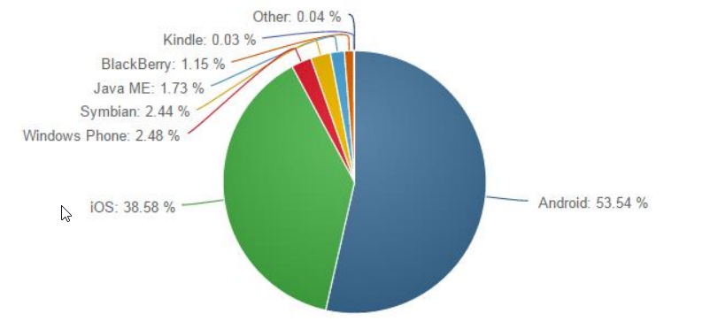
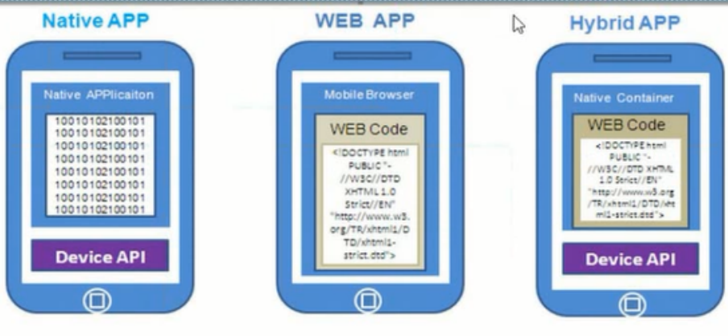

# 移动端开发知识点汇总

## 课程引导

### pc端软件和移动端app

阐述pc端软件是什么，有哪些应用。常见的例子，比如qq，360，photoShop 等等

阐述移动端app是什么，有哪些应用。常见的例子，比如 微信，手机qq，手机浏览器，美颜相机 等等

可以把手机app和pc端软件做个对比

### 程序和软件

阐述程序的概念，软件的概念；列举不同的例子。比如，在一份js文件中些的一段代码执行有特殊的功能，或者一个函数，或者一段逻辑，这些都可以称之为程序。电脑中安装的各种各样的软件，查看软件的安装位置，发现其实软件就是不同的文件通过文件夹的归类组织在一起的，不同的文件中包含着各种各样的程序。

### 手机app的运行系统

移动端应用程序需要在不同的系统中使用：android ，ios ，Windows Phone.....



了解一下各个系统的比例   

基本上只用考虑安卓和ios就可以了

### 移动端app的开发方式

如何做出一款手机app呢？

基本可以分成三种方式：

1. nativeapp（原生app）：就是用android和object-c （Swift）等原生语言开发的应用
原生程序，一般依托于操作系统，有很强的交互，是一个完整的App，可拓展性强。需要用户下载安装使用。


2. webapp：就是在浏览器中运行的web应用。用Html5语言写出的App，不需要下载安装。类似于现在所说的轻应用。生存在浏览器中的应用，基本上可以说是触屏版的网页应用

3. hybridapp（混合app）：就是外面是原生的壳，里面是webapp应用，兼具两者优势。Hybrid App同时使用网页语言与程序语言开发，通过应用商店区分移动操作系统分发，用户需要安装使用的移动应用”。总体特性更接近Native App但是和Web App区别较大。只是因为同时使用了网页语言编码，所以开发成本和难度比Native App要小很多。因此说，Hybrid App兼具了Native App的所有优势，也兼具了Web App使用HTML5跨平台开发低成本的优势

**Web开发人员写好应用的具体功能（html5语言），交给原生人员，原生人员把它打包成原生的应用；**



### 可以访问程序的设备

::: tip 想一想
平常上网的时候，都可以用什么设备呢？
:::

1. pc
2. 安卓手机
3. iphone

所以如何判断到底是谁访问了我们的应用呢？

<<< docs/outline/lesson1/fragment/browserRedirect.js

### 如何用手机浏览开发的页面

1. 在pc端启动一台服务器（推荐使用phpStudy）
2. 把开发好的页面放入服务器根目录
3. 手机和pc置于同一局域网内
4. 在手机浏览器的地址栏中输入pc的ip地址进行访问

**测试`browserRedirect.js`是否好用？**


## 移动端的布局

### 手机视口

```html
<meta content="viewport" content="width=deceive-width,inital-scale=1.0"  />
```

布局视口：绘制页面的可视区域大小 可通过 `document.documentElement.clientWidth`获取；
视觉视口：浏览页面时，页面在屏幕中展示的可视区域大小可通过`window.innerWidth`获取；
理想视口：不同的手机都一个理想视口，在理想视口下是最适合浏览的。

上述代码中，`deceive-width`就是手机的理想视口， `width=deceive-width`就是给手机的布局视口设置为理想视口的意思

`inital-scale=1.0`这个设置的是手机布局视口的初始缩放倍数，它会改变手机的布局视口，当该值大于等于1的时候，布局视口的大小永远是设置的大小。当该值小于1的时候，布局视口的值会发生变化，当该值大于等于1时，视觉视口的初始值会发生变化。公式如下：

**布局视口 = 理想视口 / initalScal  (initalScal<1)**

**视觉视口 = 理想视口 / initalScal   (initalScal>=1)**

在缩放的过程中，视觉视口也会发生变化，放大会使视觉视口变小，缩小会使视觉视口变大；


### 手机像素

1. 设备/物理像素
2. css/逻辑像素
3. 分辨率
4. 设备像素比

### 常用布局

1. 使用定位(绝对定位)布局（讲解vh,vw单位）
2. 使用弹性盒（引入弹性盒的讲解）

### 弹性盒学习

#### Flex布局是什么
    Flex是Flexible Box的缩写,意为"弹性布局",用来为盒状模型提供最大的灵活性。任何一个容器都可以指定为Flex布局
#### 为什么要使用弹性盒
    
    布局的传统解决方案,基于盒状模型,依赖 display属性 + position属性 + float属性。它对于那些特殊布局非常不方便,比如,垂直居中就不容易实现。但是弹性盒就非常的方便。
>浏览器的支持


。
    
#### 怎么设置弹性盒

    给容器设置 display:flex;
    给行内元素设置弹性盒 display: inline-flex;
>浏览器的内核

    -webkit-  // 谷歌浏览器和safir的内核
    -moz-     // 火狐的内核
    -ms-     //ie 的内核
    -o-     //欧朋浏览器的内核
>==注意,设为Flex布局以后,子元素的float、clear和vertical-align属性将失效。==

##### 基本概念
> 采用Flex布局的元素,称为Flex容器(flex container),简称"容器"。它的所有子元素自动成为容器成员,称为Flex项目(flex item),简称"项目"。


    容器默认存在两根轴:水平的主轴(main axis)和垂直的交叉轴(cross axis)
    
---
##### 容器的属性
>以下6个属性设置在容器上

######  弹性盒方向 flex-direction

- row（默认值）：主轴为水平方向，起点在左端。
- row-reverse：主轴为水平方向，起点在右端。
- column：主轴为垂直方向，起点在上沿。
- column-reverse：主轴为垂直方向，起点在下沿。


---
###### 换行 flex-wrap

- nowrap（默认）：不换行

- wrap：换行，第一行在上方


- wrap-reverse：换行，第一行在下方


---

######  复合属性flex-flow

> 复合属性 flex-direction属性和flex-wrap属性的简写形式，默认值为row nowrap

###### justify-content属性

> 定义了项目在主轴上的对齐方式

- flex-start（默认值）：左对齐
- flex-end：右对齐
- center： 居中
- space-between 两端对齐，项目之间的间隔都相等
- space-around 每个项目两侧的间隔相等。所以，项目之间的间隔比项目与边框的间隔大一倍


###### align-items

>定义项目在交叉轴上如何对齐
- flex-start：交叉轴的起点对齐
- flex-end：交叉轴的终点对齐
- center：交叉轴的中点对齐
- baseline: 项目的第一行文字的基线对齐
- stretch（默认值）：如果项目未设置高度或设为auto，将占满整个容器的高度


###### align-content属性
> 定义了多根轴线的对齐方式。如果项目只有一根轴线,该属性不起作用


##### 项目的属性

######  order

属性定义项目的排列顺序。数值越小，排列越靠前，默认为0


###### flex-grow
 flex-grow属性定义项目的放大比例，默认为0，即如果存在剩余空间，也不放大
 
 
###### flex-shrink

属性定义了项目的缩小比例，默认为1，即如果空间不足，该项目将缩小。


###### flex
    该属性是flex-grow, flex-shrink 和 flex-basis的简写，默认值为0 1 auto。后两个属性可选。
==建议优先使用这个属性，而不是单独写三个分离的属性，因为浏览器会推算相关值==

##### align-self
>允许单个项目有与其他项目不一样的对齐方式,可覆盖align-items属性


### 移动端适配

1. 使用媒体查询进行适配
2. 使用rem进行适配（关于rem的使用，以及rem的算法）

**rem的算法参考下列写法**

<<< docs/outline/lesson1/fragment/rem.js

::: tip 注意
在掌握上述的基础知识后，需要进行大量的排版练习，加深记忆
:::

## 移动端事件

### 移动端操作和pc端操作的区别
### 什么是touch事件？
>随着智能手机和平板电脑的普及, 越来越多的人用移动设备浏览网页，我们平时在pc浏览器上用的鼠标事件，比如：click, mouseover等， 已经无法满足移动设备触摸屏的特点，触摸时代的到来，离不开那些触摸事件.
touch事件多用于移动端，可响应用户手指（或触控笔）对屏幕或者触控板操作，给基于触控操作，给基于触控的用户界面提供可靠的支持。
### 移动端操作和pc端操作的区别
#### pc端事件操作
- 鼠标按下  mousedown
- 鼠标移动  mousemove
- 鼠标抬起  mouseup
#### 移动端事件操作
- 手指按下  touchstart
- 手指移动  touchmove
- 手指抬起  touchend


### 移动端的四个基本事件

1. touchstart   手指接触到屏幕就触发
2. touchmove  手指在屏幕上滑动持续触发
3. touchend   手指离开屏幕时触发
4. touchcancel  当前正在进行的事件被一些外来因素打断的时候，会触发；
::: tip
推荐使用  addEventListener的方式添加事件；
:::

### 移动端事件对象

1. touches
2. targetTouches
3. changedTouches

### 多点触摸

### 简单移动端事件的封装

为什么要封装事件，因为仅有的四个事件不符合人类的操作习惯，需要封装
1. 封装轻击（tap）
2. 封装滑动事件(swipeLeft,swipeRight,swipeTop,swipeBottom)
...
```
// 移动端的点击事件会有300ms的延迟，（这300ms的延时是来判断是单击还是双击） 优化
// 触发点击事件是
// 先触发了touch事件  如果是点击事件   没有touchmove事件
// 触屏开始 和 结束 的时间差 要小于 150ms
/*
* 参数说明
* obj：绑定点击事件的对象
* callback: 点击事件触发后 要执行的代码
* */


/* 全局污染 */
// 命名空间  避免全局污染
var myTap={
  tap:function(obj,callback){
    if(typeof obj=="object"){
      //定义变量记录数据
      var startTime=0;
      var isMove=false;
      //触屏开始
      obj.addEventListener('touchstart',function(){
        startTime=Date.now(); //时间戳
      });


      //触屏移动
      obj.addEventListener('touchmove',function(){
        isMove=true;
      });


      //触屏结束
      obj.addEventListener('touchend',function(e){
        //判断 没有移动过 时间小于150ms  为点击事件
        if(!isMove&&Date.now()-startTime<150){
          callback&&callback(e);
        }


        //数据重置
        isMove=false;
        startTime=0;
      });
  }
  }
};
```

2. 封装滑动事件(swipeLeft,swipeRight,swipeTop,swipeBottom)
```
/**
* @author accountwcx@qq.com
* http://git.oschina.net/accountwcx/rhui
* 
* swipe事件，包括swipeLeft、swipeRight、swipeUp、swipeDown。
* 调用方法
* Rhui.mobile.swipeLeft(el, callback, options)
* Rhui.mobile.swipeRight(el, callback, options)
* Rhui.mobile.swipeUp(el, callback, options)
* Rhui.mobile.swipeDown(el, callback, options)
* 如果使用jQuery，调用方法
* $(el).rhuiSwipe('swipeLeft', callback, options);
* $(el).rhuiSwipe('swipeRight', callback, options);
* $(el).rhuiSwipe('swipeUp', callback, options);
* $(el).rhuiSwipe('swipeDown', callback, options);
*/
(function(window, $){
    var Rhui = window.Rhui || {};
    window.Rhui = Rhui;
    Rhui.mobile = (function(){
        var touch = {
            distance: 30,  //滑动距离，超过该距离触发swipe事件，单位像素。
            duration: 1000 //滑动时长，超过该时间不触发swipe，单位毫秒。
        };

        /**
        * 绑定事件
        * @param  el        触发事件的元素
        * @param  swipe     事件名称，可选值为swipeLeft,swipeRight,swipeUp,swipeDown
        * @param  callback  事件回调函数
        * @param  isStopPropagation   是否停止冒泡，true为停止冒泡
        * @param  isPreventDefault    是否阻止默认事件，true为阻止默认事件
        * @param  triggerOnMove       swipe事件有两种触发方式，一种是在touchmove过程中，只要满足滑动距离条件即触发。
        *                             一种是在touchend中，进入滑动距离判断，如果满足滑动距离触发。
        *                             默认是在touchend中触发。
        */
        function bindSwipe(el, swipe, callback, triggerOnMove, isStopPropagation, isPreventDefault){
            var startPoint, endPoint, timer;

            /**
            * 计算滑动方向
            * 首先根据x方向和y方向滑动的长度决定触发x方向还是y方向的事件。
            * 然后再判断具体的滑动方向。
            * 如果滑动距离不够长，不判断方向。
            */
            function swipeDirection(x1, y1, x2, y2){
                var diffX = x1 - x2,
                    diffY = y1 - y2,
                    absX = Math.abs(diffX),
                    absY = Math.abs(diffY),
                    swipe;

                if(absX >= absY){
                    if(absX >= touch.distance){
                        swipe = diffX > 0 ? 'swipeLeft' : 'swipeRight';
                    }
                }else{
                    if(absY >= touch.distance){
                        swipe = diffY > 0 ? 'swipeUp' : 'swipeDown';
                    }
                }

                return swipe;
            }

            // 清除本次滑动数据
            function clearSwipe(){
                startPoint = undefined;
                endPoint = undefined;

                if(timer !== undefined){
                    clearTimeout(timer);
                    timer = undefined;
                }
            }

            /**
            * 判断是否符合条件，如果符合条件就执行swipe事件
            * @param  el     {HTMLElement}  元素
            * @param  event  {Event}        Touch原始事件
            * @param  return 如果执行了事件，就返回true。
            */
            function execSwipe(el, event){
                if(startPoint && endPoint && swipeDirection(startPoint.x, startPoint.y, endPoint.x, endPoint.y) === swipe){
                    callback.call(el, event);
                    return true;
                }
            }

            el.addEventListener('touchstart', function(event){
                var self = this, touchPoint = event.touches[0];

                if(isStopPropagation){
                    event.stopPropagation();
                }

                if(isPreventDefault){
                    event.preventDefault();
                }

                startPoint = {
                    x: Math.floor(touchPoint.clientX),
                    y: Math.floor(touchPoint.clientY)
                };

                timer = setTimeout(function(){
                    //如果超时，清空本次touch数据
                    clearSwipe();
                }, touch.duration);
            });

            el.addEventListener('touchmove', function(event){
                var self = this, touchPoint = event.touches[0];

                if(isStopPropagation){
                    event.stopPropagation();
                }

                if(isPreventDefault){
                    event.preventDefault();
                }

                if(startPoint){
                    endPoint = {
                        x: Math.floor(touchPoint.clientX),
                        y: Math.floor(touchPoint.clientY)
                    };

                    //执行swipe事件判断，是否符合触发事件
                    if(triggerOnMove){
                        if(execSwipe(self, event)){
                            clearSwipe();
                        }
                    }
                }
            });

            el.addEventListener('touchend', function(event){
                if(isStopPropagation){
                    event.stopPropagation();
                }

                if(isPreventDefault){
                    event.preventDefault();
                }

                execSwipe(self, event);
                //清除本次touch数据
                clearSwipe();
            });
        }

        /**
        * @param  el        {HTMLElement}  HTML元素
        * @param  callback  {Function}     事件回调函数
        * @param  options   {Object}       可选参数
        *                   isStopPropagation  {Boolean}  是否停止冒泡，true为停止冒泡
        *                   isPreventDefault   {Boolean}  是否阻止默认事件，true为阻止默认事件
        *                   triggerOnMove      {Boolean}
        *                                       swipe事件有两种触发方式，一种是在touchmove过程中，只要满足滑动距离条件即触发。
        *                                       一种是在touchend中，进入滑动距离判断，如果满足滑动距离触发。
        *                                       默认值为false，在touchend中触发。
        */
        touch.swipeLeft = function(el, callback, options){
            if(options){
                bindSwipe(el, 'swipeLeft', callback, options.triggerOnMove, options.isStopPropagation, options.isPreventDefault);
            }else{
                bindSwipe(el, 'swipeLeft', callback);
            }

        };

        touch.swipeRight = function(el, callback, options){
            if(options){
                bindSwipe(el, 'swipeRight', callback, options.triggerOnMove, options.isStopPropagation, options.isPreventDefault);
            }else{
                bindSwipe(el, 'swipeRight', callback);
            }
        };

        touch.swipeUp = function(el, callback, options){
            if(options){
                bindSwipe(el, 'swipeUp', callback, options.triggerOnMove, options.isStopPropagation, options.isPreventDefault);
            }else{
                bindSwipe(el, 'swipeUp', callback);
            }
        };

        touch.swipeDown = function(el, callback, options){
            if(options){
                bindSwipe(el, 'swipeDown', callback, options.triggerOnMove, options.isStopPropagation, options.isPreventDefault);
            }else{
                bindSwipe(el, 'swipeDown', callback);
            }
        };

        return touch;
    })();


    }   
})(window, $);
```

::: tip
在移动端不要使用pc端事件
:::

## 过渡动画和变形

1. transition的用法
2. transform的变形（位移，变形，拉伸，缩放）

## animation动画

### transition 语法
    transition: property（过度的属性名称）duration(动画执行的总时长) 单位是秒或者毫秒 timing-function(动画运动的曲线) delay（动画何时开始）单位是秒或者毫秒
#### timing-function （运动曲线）
- linear //匀速
- ease   // 慢速开始，变快，慢速结束
- ease-in  //慢速开始
- ease-out //慢速结束
- ease-in-out  //慢速开始，慢速结束 
- cubic-bezier(n,n,n,n)  //贝塞尔曲线
2. transform的变形（位移，变形，拉伸，缩放）
### transform  改变属性
#### 位移
    translate(x,y) //改变位移 (2d)
    translate3d(x,y,z) //改变位移(3d)
    translateX(X)  //改变X方向
    translateY(Y)  //改变y方向
    translateZ(Z)  //改变z方向
#### 缩放
    scale(x,y) //2d
    scale3d(x,y,z)  //3d
    scaleX(x)
    scaleY(y)
    scaleZ(z)
####  旋转
    rotate(angle) //2d
    rotate3d(x,y,z,angle) //3d 第四个参数指的是旋转的角度
    rotateX(angle) 
    rotateY(angle) 
    rotateZ(angle) 

#### 切斜 //没有3d方法
    skew(xAngle,yAngle)
    skewX(xAngle)
    skewY(yAngle)


    
#### 过渡多个属性的时候，用逗号隔开
> transition:width 1s linear,height 1s linear;

---

>transition:all 1s linear;

#### 过渡transform属性的时候,以下两种方法都可以
    transition:transform 1s linear;
    transition:all 1s linear;

#### 改变多个属性的时候,空格隔开
    transform:scale(2) rotate(45deg);


## animation动画
### 定义关键帧动画

    @keyframs 动画名称 {
        0%{  // 等于from
            需要改变的属性
        }
        
        100%{  //等于to
             需要改变的属性
        }
    }

### 调用帧动画
    animation: name duration timing-function delay  animation-iteration-count(播放次数)  animation-direction(是否轮流反向播放)

#### 设置播放次数
    animation-iteration-count:infinite(无限循环)
#### animation-play-state
> 规定当前的动画是正在执行还是暂停

    animation-play-state：paused(暂停)/running(正在执行)
    
#### animation-fill-mode 
> 规定动画开始之前或者之后，动画效果是否可见

    animation-fill-mode：both/forwards(保留动画最后一帧的状态)/backwards/none
    
### 区别
- transition需要事件或者伪类来触发，animation不需要
- transition只要开始和结束两个状态。animation可以定义中间的状态
- animation可以设置动画的播放次数，还可以设置动画的暂停状态


### steps （也是来定义动画的运动曲线）

> steps关键帧之间的跳跃，而linear、ease这些是连贯性的。

#### 语法
    steps(n,[start|end]);  //n是自然数，把动画分成n份；
    stpes(1,start) === step-start //跳过第一帧（0%）
    stpes(1,end) === step-end //跳过最后一帧(100%)
## 多媒体(视频和音频)

### video标签

1. video标签的用法
2. 视频节点
3. 视频的格式和兼容

### audio标签

1. audio标签的用法
2. 音频节点
3. 音频的格式和兼容

## H5新增api

### web存储

### 拖拽

1. 拖拽操作和拖拽属性(draggable)
2. 拖拽元素和它的事件
3. 目标元素和它的事件
4. 拖拽中的事件传递

### dom新增
1. classList对象
```
<video src="song.mp3" controls="controls" loop="loop" autoplay="autoplay">亲 您的浏览器不支持html5的video标签</video>
```
2. 拥有两份源文件的音频播放器
```
    <video controls>
        <source src="horse.ogg" type="video/ogg">
        <source src="horse.mp3" type="video/mpeg">
        Your browser does not support the video element.
    </video> 
```
3. 视频的格式和兼容

浏览器 | 版本 | 支持格式
---|---|---
Internet Explorer | 9.0+ | MP4
Chrome | 6.0+ |  MP4,WebM,Ogg
Firefox | 3.6+ | WebM,Ogg
Safari | 5.0+ | MP4
Opera | 10.0+ | WebM,Ogg
>从浏览器支持的视频格式来看，最佳的方式是提供WebM和MP4两种格式的视频。兼容代码如下：

```
<video controls>    

    <source src=video.webm type=video/webm>    

    <source src=video.mp4 type=video/mp4>      

    <!—向后兼容代码: -->      

    <iframe width="480" height="360" src="http://www.youtube.com/embed/xzMUyqmaqcw?rel=0" frameborder="0" allowfullscreen></iframe>  

</video>
```

### audio标签

1. audio标签的用法
```
    <audio src="song.mp3" controls="controls" loop="loop" autoplay="autoplay">亲 您的浏览器不支持html5的audio标签</audio>
```
2. 拥有两份源文件的音频播放器
``` <audio controls>
        <source src="horse.ogg" type="audio/ogg">
        <source src="horse.mp3" type="audio/mpeg">
        Your browser does not support the audio element.
    </audio> 
```
3. 音频的格式和兼容

浏览器 | 版本 | 支持格式
---|---|---
Internet Explorer | 9.0+ | MP3, AAC
Chrome | 6.0+ |  Ogg Vorbis, MP3, WAV（9.0+）
Firefox | 3.6+ | Ogg Vorbis, WAV
Safari | 5.0+ | MP3, AAC, WAV
Opera | 10.0+ | Ogg Vorbis, WAV

>大约有80%的浏览器支持HTML5的`audio`标签，但是并没有一种统一的音频格式。从支持的格式来看，要让所有的浏览器可以播放audio元素上的音频，最佳的方式是提供MP3和Ogg两种格式，兼容代码如下：
```
<audio controls>

    <source src="elvis.mp3" type='audio/mpeg; codecs="mp3"'>

    <source src="elvis.oga" type='audio/ogg; codecs="vorbis"'>

    <!-- 向后兼容代码：如，显示提示信息、提供下载链接使用flash播放器等 -->

    浏览器不支持<code>audio</code>标签

</audio>
```
### 属性

名称 | 说明
---|---
src | 歌曲的路径
controls | 设置或返回音频/视频是否显示控件（比如播放/暂停等），默认是false，不显示控件
loop | 设置或返回音频/视频是否应在结束时重新播放
autoplay | 当歌曲加载后自动播放，但是只有pc端可以实现,移动端不行
currentTime | 指示音频/视频播放的当前位置（以秒计）
playbackRate | 设置或返回音频/视频播放的速度
duration | 返回当前音频/视频的长度（以秒计）
ended | 返回音频/视频的播放是否已结束，如果播放已结束，则返回 true
muted | 设置或返回音频/视频是否静音，布尔值，默认是false，不静音
paused | 返回音频/视频是否暂停，true 指示音频/视频已暂停。布尔值
volume | 设置或返回音频/视频的音量，值介于0-1之间，0===muted


### 方法

名称 | 说明
---|---
load()  | 重新加载音频/视频元素
play() | 开始播放音频/视频
pause() | 暂停当前播放的音频/视频


### 事件

名称 | 说明
---|---
canplaythrough  | 当浏览器可在不因缓冲而停顿的情况下进行播放时
ended | 当目前的播放列表已结束时
timeupdate | 当目前的播放位置已更改时
## H5新增api


### web存储
#### 什么是本地存储
    通过本地存储（Local Storage），web 应用程序能够在用户浏览器中对数据进行本地的存储。在 HTML5 之前，应用程序数据只能存储在 cookie 中，包括每个服务器请求。本地存储则更安全，并且可在不影响网站性能的前提下将大量数据存储于本地。
#### webStorage的两种存储属性
##### 永久存储
    window.localStorage  
    
##### 会话级别，当当前会话关闭或者浏览器关闭之后，数据清空
    window.sessionStorage
#### API
##### 存储数据
- localStorage.setItem("name","caibin") //存储名字为name值为caibin的变量
- localStorage.name = "caibin"; // 等价于上面的命令
##### 读取数据
- localStorage.getItem("name") //caibin,读取保存在localStorage对象里名为name的变量的值
- localStorage.name // "caibin"
##### 删除某个变量
- localStorage.removeItem("name"); //undefined
##### 清空本地存储
- localStorage.clear();
##### 所有数据
- localStorage.valueOf()
##### 获取本地存储的长度
- localStorage.length
##### 获取本地存储的键名
- localStorage.key(i) // i是下边
### 拖拽
    HTML5中新加的元素拖放（Drag &Drop）是一种常见的特性，即抓取对象以后拖到另一个位置。在 HTML5 中，拖放是标准的一部分，任何元素都能够拖放.
>过去，我们用监听鼠标的Mousedown、Mouseove、Mouseup等事件来不停地获取鼠标的坐标来修改元素的位置，而现在html5原生的Drag &Drop事件（DnD），方便了许多，而且性能也有了提高。
#### 浏览器的支持
    支持该效果的浏览器有：Internet Explorer 9+、Firefox、Opera 12、Chrome 以及 Safari 5 支持拖放
#### 怎么设置为可拖放元素
    给需要拖放的元素添加一个draggable= true;a、img默认可拖放
#### 拖拽(源对象)
##### 事件
- dragstart //源对象开始被拖动的时候触发
- drag //源对象移动的过程中触发
- dragend //源对象结束被拖拽的时候触发
#### 释放(目标对象)
##### 事件
- dragenter //源对象进入目标对象时候触发
- dragover //源对象在目标对象里面移的时候触发
- dragleave //源对象离开目标对象的时候触发
- drop //源对象在目标对象里面释放的时候触发的

##### 如何在拖动的源对象事件和目标对象事件间传递数据
    e.dataTransfer{}  //源对象盒目标对象之间传递数据用的
>存值

    在源对象的事件处理函数中存值 e.dataTransdfer.setData(k,v); // k,v必须时字符串

>取值 

    在目标对象的事件处理函数中取值 e.dataTransfer.getData(k);
>设置源对象开始移动时，生成的半透明图像，它时跟随着鼠标移动的

    e.dataTransfer.setDragImage(img,x,y);

### dom新增
1. classList对象
    Element.classList 是一个只读属性,返回一个元素的类属性的实时DOMTokenList 集合
#### API
> add()  

    在元素中添加一个或多个类名，如果指定的类名已存在，则不会添加
> contains(class)

    	返回布尔值，判断指定的类名是否存在。
        可能值：
            true - 元素包已经包含了该类名
            false - 元素中不存在该类名
>remove(class1, class2, ...)

    移除元素中一个或多个类名。===注意： 移除不存在的类名，不会报错。===
>toggle(class, true|false)

    在元素中切换类名
>length 

    返回类列表中类的数量,该属性是只读的
2. dataset对象

## canvas

## 库和插件

1. bootstrap
2. zepto
3. better-scroll
4. fastclick
5. swiper


### 13113


