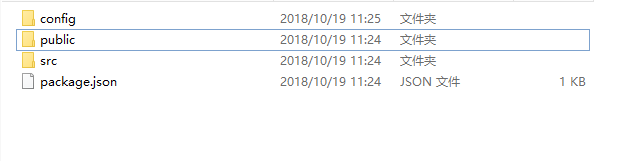
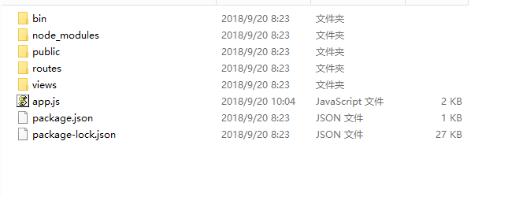
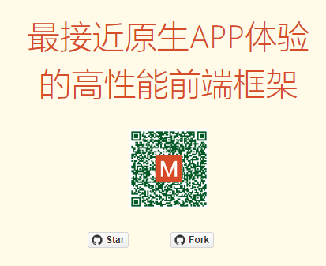

# 知识点

## 课程引导

## git

## gulp

### 前端构建需求

1. 需要压缩文件
2. 需要合并文件
3. 需要编译文件
...

### 基于nodejs

1. gulp是nodejs的一个第三方模块
2. gulp可以以命令行的方式运行
3. gulp提供node的api，可自定义任务流

### gulp的安装

1. 全局安装
2. 本地安装
3. 查看gulp在本地和全局安装的位置
4. 查看命令行启动文件 gulp.cmd
    - 全局的gulp.cmd
    - 本地的gulp.cmd

### gulp的基本使用

1. gulpfile.js脚本的编写
2. gulp相关api的认知
    - gulp.src
    - gulp.dest
    - gulp.task
    - gulp.watch
    - gulp.parallel
    - gulp.series
3. gulp相关插件的使用
4. gulp命令行的相关使用
    - `-v` 或 `--version` 会显示全局和项目本地所安装的 gulp 版本号

    - `--require <module path>` 将会在执行之前 reqiure 一个模块。这对于一些语言编译器或者需要其他应用的情况来说来说很有用。你可以使用多个--require

    - `--gulpfile <gulpfile path>` 手动指定一个 gulpfile 的路径，这在你有很多个 gulpfile 的时候很有用。这也会将 CWD 设置到该 gulpfile 所在目录
    - `--cwd <dir path>` 手动指定 CWD。定义 gulpfile 查找的位置，此外，所有的相应的依赖（require）会从这里开始计算相对路径
    - `-T 或 --tasks` 会显示所指定 gulpfile 的 task 依赖树
    - `--tasks-simple` 会以纯文本的方式显示所载入的 gulpfile 中的 task 列表
    - `--color` 强制 gulp 和 gulp 插件显示颜色，即便没有颜色支持
    - `--no-color` 强制不显示颜色，即便检测到有颜色支持
    - `--silent` 禁止所有的 gulp 日志

### gulp的应用

1. gulp在项目中的使用
2. 使用`Browsersync`搭建开发时服务环境
3. `Browsersync`的相关配置和使用

**参考实际项目结构**

## 接口服务器(npm,node,express)

1. 使用express搭建接口服务器
2. 开发相关接口
3. 添加相关中间件
4. 结合mysql

**参考该文件夹结构**

## mui

### mui介绍

mui是一个最接近原生APP体验的高性能前端框架

**轻量**

追求性能体验，是我们开始启动MUI项目的首要目标，轻量必然是重要特征；

MUI不依赖任何第三方JS库，压缩后的JS和CSS文件仅有100+K和60+K

**原生UI**

鉴于之前的很多前端框架（特别是响应式布局的框架），UI控件看起来太像网页，没有原生感觉，因此追求原生UI感觉也是我们的重要目标

MUI以iOS平台UI为基础，补充部分Android平台特有的UI控件

**流畅体验**

为实现下拉刷新功能，大多H5框架都是通过DIV模拟下拉回弹动画，在低端android手机上，DIV动画经常出现卡顿现象（特别是图文列表的情况）； mui通过双webview解决这个DIV的拖动流畅度问题；拖动时，拖动的不是div，而是一个完整的webview（子webview），回弹动画使用原生动画

### mui使用

1. ui组件
2. 窗口管理
3. 事件管理
4. mui的ajax
5. utils
6. 上拉加载和下拉刷新

## 项目(柠檬记账简化版)

### 项目ui图

### 项目逻辑梳理

### 项目接口

### 前端实现

