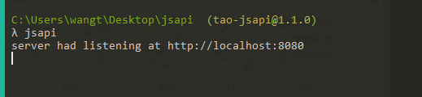

# 知识点

## jsapi系统

### 搭建 jsapi系统

1. 全局安装`jsapi`模块

```js
npm install tao-jsapi -g
```

2. 启动`jsapi`，在命令行输入下面命令

```js
jsapi
```

3. 如下代表启动成功



4. 如果该系统更新，执行下列命令进行更新

```js
npm update jsapi -g
```
## 相关接口文档

### 1.获取所有学生信息的接口

::: tip 获取所有学生信息的接口
接口地址：http://localhost:8080/getAllStudentInfo

请求方式：GET

请求参数：无

返回数据：`<Array> [{字段1：，字段2},{}]` 

字段如下：

```js
    {
        code:<Number> [状态码],
        msg:<String> [转态信息],
        data:[
            {
                studentName:<Stirng> [学生姓名],
                sid:<String> [学生编号],
                studentScore:<Number> [学生成绩]
            },
            ...
        ]
    }
    
```
:::

### 2.添加单个学生信息的接口

::: tip 添加单个学生信息的接口
接口地址：http://localhost:8080/addStudentInfo

请求方式：POST

请求参数：`<Object>`

字段如下：
```js
{
    studentName:<Stirng> [学生姓名], //必传
    studentScore:<Number> [学生成绩] // 必传
}
```

返回数据：`<Array> [{字段1：，字段2},{}]` 

字段如下：

```js
    {
        code:<Number> [状态码],
        msg:<String> [转态信息]
    }
```
:::

### 3.修改单个学生信息的接口

::: tip 修改单个学生信息的接口
接口地址：http://localhost:8080/updateStudentInfo

请求方式：POST

请求参数：`<Object>`

字段如下：
```js
{
    studentName:<Stirng> [学生姓名],//可不传
    sid:<String> [学生编号], //必传
    studentScore:<Number> [学生成绩] // 可不传
}
```

返回数据：`<Object>` 

字段如下：

```js
    {
        code:<Number> [状态码],
        msg:<String> [转态信息]
    }
```
:::

### 4.删除单个学生信息的接口

::: tip 4.删除单个学生信息的接口
接口地址：http://localhost:8080/delStudentInfo

请求方式：POST

请求参数：`<Object>`

字段如下：
```js
{
    sid:<String> [学生编号] //必传
}
```

返回数据：`<Object>` 

字段如下：

```js
    {
        code:<Number> [状态码],
        msg:<String> [转态信息]
    }
```
:::


