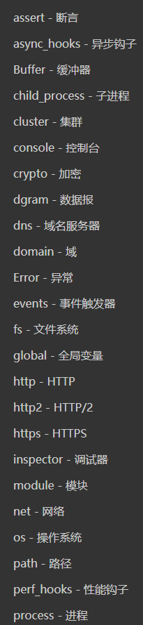
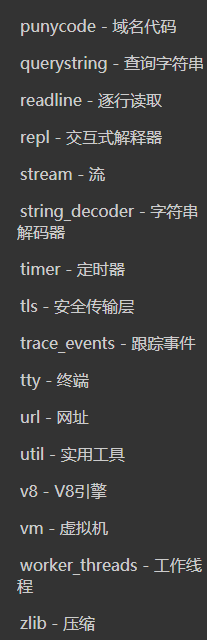

# 知识点(服务端开发)

## 课程引导

### javaScript可以用来做什么

1. 最初，js被用来在浏览器端实现表单的验证。
2. 在浏览器端可以使用js操作dom实现各种各样的效果和动画。
3. 浏览器端的js可以处理数据，实现各种页面功能。
4. 可以使用JavaScript发出http请求，实现各种交互任务

**以上，是浏览器中js的功能。换句话说，就是JavaScript脱离了浏览器，上述功能也就不存在了。**

**当然，浏览器也会对JavaScript有一些限制，比如一些常见的文件操作，系统接口的调用，数据库连接等等这些功能都无法实现**

于是在2009年，Ryan正式推出了基于JavaScript语言和V8引擎的开源Web服务器项目，命名为Node.js。虽然名字很土，但是，Node第一次把JavaScript带入到后端服务器开发，加上世界上已经有无数的JavaScript开发人员，所以Node一下子就火了起来。

正是因为node的出现，我们的JavaScript才可以脱离浏览器去运行，当然也没有了浏览器的一些限制了。同样的，在浏览器的部分功能也就不存在了，比如：操作dom！

**那么运行在node上的JavaScript可以做什么呢？**

1. 可以制作命令行工具（所谓命令行工具就是通过dos命令来操作的软件）
2. 可以做服务端的开发 （基于node可以开发服务器应用，就像php一样。。。）

### node的重要性

1. 它很火-从2009年nodejs诞生以来，社区为node提供的模块已经超过了15万个，并且在持续增长。而且每个月有维持在6亿多的下载量
2. 它很强-众多应用的开发都会使用到nodejs

### nodejs是什么

1. nodejs是一款软件，就像qq一样，qq提供给我们的功能是交友，聊天。而node的功能就是去执行JavaScript程序。
2. 在使用方式上，会有一些区别，使用qq我们通过鼠标的点击就可以操作了。但是node是通过命令行去操作的。

**所以，nodejs其实就是为JavaScript提供运行环境的一款软件（windows版本，linux版本，mac版本）**

## node的安装和基础知识

### node安装
1. node的下载和版本选择
2. 查看node的安装路径
3. 验证node安装是否成功  `node -v`
4. 简单的使用node执行一段js文件（阐明js在node环境下运行和浏览器的区别以及运行方式）

### npm简单介绍

1. 验证npm是否可以`npm -v`
2. 查看npm的安装位置 
3. npm的基本作用-包管理器

### node应用的编写

1. `npm init`初始化一个项目目录
2. `package.json`的简单介绍
3. node程序的简单编写
4. node程序的执行
5. 添加脚本命令

### node中的模块

1. 随着应用体积的增大，给将应用拆分为模块是非常必要的。
2. node中模块的分类
    - 核心模块
    - 第三方模块
    - 自己编写的模块（一份js就是一个模块）
3. 遵循commonjs规范
    - 模块化规范规定了一个模块如何被创建，如何引入模块，如果到处模块
    - commonjs规定一个js文件就是一个模块
    - 使用`require`导入模块
    - 使用`module.exports`或者`exports`导出模块
    - nodejs实现了这个规范，因此nodejs的每个文件就是一个模块，且提供了全局的`require`方法和`module`对象
### 核心模块

1. node本身提供了很多有用的模块，这些模块可以直接引如，通过传递模块名就可以  比如  `require('http')`
2. 引入核心模块后，返回一个对象，该对象提供了这个模块的所有`api`方法
3. 我们不用关系模块内部如何使用，只要知道模块如何使用，有些模块的底层是使用`c++`编写的。

**常见的node核心模块如下**

### 第三方模块

1. 使用javaScript编写的模块，一般可以发布在`npmjs.com`上；
2. 使用`npm`安装，一般安装在本地的`node_modules`中，如果全局安装的话，安装在全局路径中,可以使用`npm root -g`去查看
3. 

