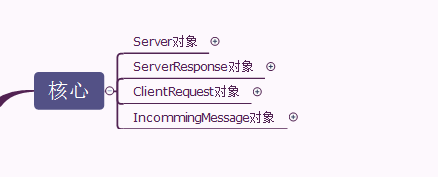
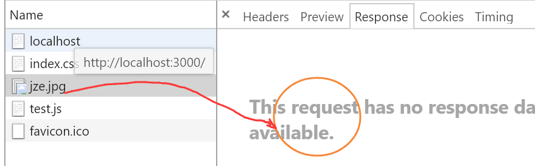
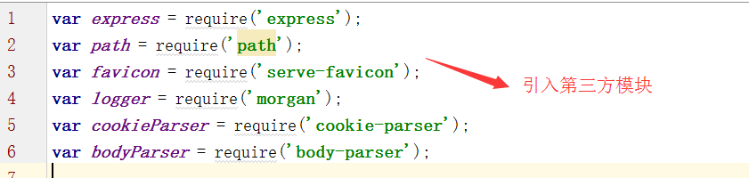

# 知识点(服务端开发)

## 课程引导

### javaScript可以用来做什么

1. 最初，js被用来在浏览器端实现表单的验证。
2. 在浏览器端可以使用js操作dom实现各种各样的效果和动画。
3. 浏览器端的js可以处理数据，实现各种页面功能。
4. 可以使用JavaScript发出http请求，实现各种交互任务

**以上，是浏览器中js的功能。换句话说，就是JavaScript脱离了浏览器，上述功能也就不存在了。**

**当然，浏览器也会对JavaScript有一些限制，比如一些常见的文件操作，系统接口的调用，数据库连接等等这些功能都无法实现**

于是在2009年，Ryan正式推出了基于JavaScript语言和V8引擎的开源Web服务器项目，命名为Node.js。虽然名字很土，但是，Node第一次把JavaScript带入到后端服务器开发，加上世界上已经有无数的JavaScript开发人员，所以Node一下子就火了起来。

正是因为node的出现，我们的JavaScript才可以脱离浏览器去运行，当然也没有了浏览器的一些限制了。同样的，在浏览器的部分功能也就不存在了，比如：操作dom！

**那么运行在node上的JavaScript可以做什么呢？**

1. 可以制作命令行工具（所谓命令行工具就是通过dos命令来操作的软件）
2. 可以做服务端的开发 （基于node可以开发服务器应用，就像php一样。。。）


### node的重要性

1. 它很火-从2009年nodejs诞生以来，社区为node提供的模块已经超过了15万个，并且在持续增长。而且每个月有维持在6亿多的下载量
2. 它很强-众多应用的开发都会使用到nodejs


### nodejs是什么

1. nodejs是一款软件，就像qq一样，qq提供给我们的功能是交友，聊天。而node的功能就是去执行JavaScript程序。
2. 在使用方式上，会有一些区别，使用qq我们通过鼠标的点击就可以操作了。但是node是通过命令行去操作的。

**所以，nodejs其实就是为JavaScript提供运行环境的一款软件（windows版本，linux版本，mac版本）**


## 了解web架构

### 什么是web？

web就是我们常见的www（world wide web），中文名字叫万维网。

所以万维网跟我们所学习的html，css，js有什么关系呢？


总结一下：
- web就是www，万维网
- www（web）是互联网的一个方面。
- www是由网站构成的，网站又有网页构成的，网页又分为html、css和js

### web由哪些构成？

所谓的网站，就是一种服务。
我们可以把web看成是由两个部分组成的
- 服务端
- 浏览器端

看下图：


这种架构，就称之为B/S架构。

所谓的Server，就是性能比较强悍、价格比较昂贵的计算机，在计算器中安装了相应的一些软件，运行这些软件，为用户提供相应的服务。
针对真实的server，一般来说，不需要显示器，并且是长期运行的。

常见的服务器如下图：


B/S和C/S是相对的。
在软件开发领域中，就存在两种架构：
- C/S架构，Client/Server，传统的软件形式，需要在用户的计算机中安装一个客户端软件，然后才可以去使用这个服务，比如qq、杀毒软件、游戏、办公软件
- B/S架构，Browser/Server，就是现在所有的webapp，通过浏览器来访问的

对比一下这两种架构

√ | C/S | B/S
-|-|-
使用层面  |	需要安装特定的客户端软件  |	只需要有浏览器即可
维护更新 |	客户端软件需要重新下载安装 |	打开浏览器永远都是最新的
用户体验 |	更为流畅，反应更迅速 |	不流畅，经常卡顿
性能 |	性能优  胖客户端/瘦服务端 |	性能稍弱  瘦客户端/胖服务端

随着互联网的发展，主要有两个方面

- 带宽的增加
- 开发技术的创新

未来的趋势就是B/S架构。
所以，有越来越多的软件，逐渐的从C/S模式开始转变为B/S模式。

其实，移动端也是这种趋势。
- 原生的app应用，就好比是C/S模式
- 基于h5的webapp，就好比是B/S模式

### web如何为用户提供服务的？（重点）

作为一名web开发人员，必须要搞清楚这个流程。
请问：
1. 淘宝网站是如何为用户提供服务的?
2. 在百度中输入搜索关键字，然后返回了页面，这中间发生了哪些动人的故事?

大致的流程如下：


整个流程包括三个方面：
- 浏览器端：html、css和js
- 服务端：web服务器、后端语言、数据库
- 浏览器端和服务端端通信：HTTP

其中，需要注意，我们说的浏览器端，是指浏览器会获取从服务器端返回的html、css和js，然后进行解析的。

转变一个思维：我们平常开发的静态页面和app，最终是需要放到服务器端，然后用户在访问的时候，会将这些页面的html、css和js下载到自己的浏览器的内存中，然后进行解析渲染。

返回的过程，可以通过network面板来进行查看。

## nodejs快速入门

### 再谈客户端JavaScript

有如下几个问题：
- 什么是JavaScript？
- JavaScript的运行环境是？
- 浏览器中的JavaScript 可以做什么？
- 浏览器中的JavaScript 不可以做什么？
- JavaScript只可以运行在浏览器中吗？
- 编程语言的能力取决于什么？

1. 什么是JavaScript？
Javascript是一门运行在浏览器端的脚本语言。
两大方面：
    - 在浏览器端运行的（还有在服务端运行的，比如php）
    - 脚本语言，嵌入到其他的语言中（插入到html中）


2. JavaScript的运行环境是？
就是浏览器。

3. 浏览器中的JavaScript 可以做什么？
在浏览器端，主要是使用js来实现DOM操作。
    - 表单验证
    - 实现一些特性和动画
    - 更好的组织页面的结构（tab选项卡、轮播图）
    - 可以使用ajax来提升用户体验
    - 页游

4. 浏览器中的JavaScript 不可以做什么？
作为一门编程语言，js和其他语言相比，它不能干什么？
其他语言，比如c、c++、c#、java、php等
js不能做的事情如下：
    - 文件操作
    - 网络编程
    - os相关操作
    - 数据库操作
    - ...

所以，我们发现，作为一门编程，居然有很多事情都不能做？
所以，这正是过去js被人鄙视的原因。认为就是js是一门玩具式的语言。

5. JavaScript只可以运行在浏览器中吗？
在09年以前，基本上只能在浏览器中运行的。
但是09年之后，情况发生了变化。

Javascript除了在浏览器中运行，它还可以在其他环境运行，比如服务端。

6. 编程语言的能力取决于什么？
其实，各门语言的功能大同小异，基本都具备下面这些内容：
    - 变量和常量
    - 数据类型
    - 表达式
    - 语句（顺序、分支、循环）
    - 函数
    - 类和对象
    - 继承

编程语言的能力取决于它所运行的环境（平台）。
舞台有多大，人的潜力就有多大。

不同的语言，有不同的运行环境。
Java最强，因为有虚拟机，就可以在任何操行系统上执行。
C#局限性有点强，因为它只能运行在windows操作系统的.net环境中
C，可以在任何os中运行。

Js也不例外，过去之所以弱，就是由于它的运行环境很单一，只是浏览器。
但是现在不一样了，在服务端环境中也可以执行的。

自此，js是大放异彩。
如果说有一门语言，会统治服务端开发、浏览器端开发、app开发，这门语言一定是js

### 什么是node.js？

官网：https://nodejs.org/en/

Node.js® is a JavaScript runtime built on Chrome's V8 JavaScript engine. Node.js uses an event-driven, non-blocking I/O model that makes it lightweight and efficient. Node.js' package ecosystem, npm, is the largest ecosystem of open source libraries in the world.

中文网站：http://nodejs.cn/

- Node.js 是一个基于 Chrome V8 引擎的 JavaScript 运行环境。 
- Node.js 使用了一个事件驱动、非阻塞式 I/O 的模型，使其轻量又高效。 
- Node.js 的包管理器 npm，是全球最大的开源库生态系统。

记住一点：node.js其实一个运行环境，和浏览器是同等地位。
并且，node.js这个运行环境是基于chrome v8引擎的，说明在浏览器端写的那些和浏览器环境无关的代码，在node.js中，也是同样支持的。

有很多初学者认为：node.js是一门语言，这是极其错误的。

**node.js和javascript到底是什么关系呢？**

回顾js的历史：
- 94年，livescript
- 95年，javascript
- 后来交给了一个机构----ECMA，其实将js进行了标准化---ECMAScript规范

- 1999年-2009年叫 ECMAScript3.0
- 2009年-2015年叫 ECMAScript5.0
- 16年至今叫 ECMAScript 6

所以，过去js有两个名称：
- ECMAScript版本号 （官方）
- Javascript（民间）

以前，两种叫法没啥区别。都是在浏览器端来执行的脚本语言。
但是，随着node.js的出现，其实ECMAScript 和 javascript是有区别的，
ECMAScript才是语言本身。


### nodejs可以做什么？

使用Node.js可以轻松的进行服务器端应用开发，PHP、Python、Ruby能做的事情Node.js几乎都能做，而且在某些方面可以做的更好。

世界上70%以上的网站都是使用php来做的。
世界上100%的网站都使用了js。

具体来说，体现在两个方面：
- webapp（网站）
- 命令行（包括命令行工具和交互式终端程序）

其中，我们的重点是放在webapp上面。
越来越多的网站，都开始大面积的使用node.js
- 阿里（天猫）
- uber
- Yahoo
- Paypal
- Group on

既然已经有了PHP等后台语言，为何还需要Node.js？
- io密集型 --- 异步io操作
- 实时web应用 ---- socket.io

io是指input/output，输入和输出，文件操作。
实时web应用：双十一、12306、游戏、在线客服/咨询

大家需要明白，一个大型的软件，通常是结合各种技术来实现的，并不会使用单一的技术。
比如，阿里用到了php、java、c++、node.js这几种语言，数据库就使用了mysql、oracle、mongodb、redis等数据库。

### 学习nodejs的必要性

- 高薪资
- 企业的需求
- 更好的理解js语言
- 紧跟潮流

Node.JS超越jQuery成为Github上第二受欢迎的开源项目
GitHub公布10大热门编程语言：Javascript居首

https://www.npmjs.com/enterprise

下图是nodejs的下载量：


### nodejs的特点

- 单线程
- 异步式I/O
- 事件驱动机制
- 跨平台

其实，这些特点是js本身的，只不过在node.js中表现尤为突出。

### node.js的下载及安装

1. 下载

官网下载地址：https://nodejs.org/en/download/
中文下载地址：http://nodejs.cn/download/

LTS：Long Term Support，长效版，长期支持的版本，通常是3年。


2. 安装

以windows操作系统为例
是一个典型的windows应用程序的安装，和qq是一样的。
主要有两点：
- 装在哪儿
- 怎么装，有何细节

爱装哪儿装哪儿，建议使用默认的安装路径，放在c盘。
安装的时候，一路next下去，不用做任何的额外设置，装完即可。

安装过程，略过....
安装完成之后，可以查看其版本号：


如果没有看到这个结果，说明安装失败了，重新安装即可。

### Node.js初体验

现在，就可以编写服务端的js代码了

#### REPL环境及Hello，world程序

所谓的REPL，就是指 交互式解释器环境，read-eval-print-loop
交互式解释器会读取输入内容并对它求值,再返回结果并输出，然后重复此过程。

浏览器的console控制台，就是一个简单的REPL环境。


实际上，很多的软件/工具，都提供了这个REPL环境。
Node.js也提供了这么一个REPL环境。

在cmd窗口中，输入node，按下回车，就进入了一个REPL环境，如下：


在这个REPL环境中，可以编写任何服务端的js代码，并执行。


这个过程，和在浏览器控制台的REPL环境中，是一模一样的。


再来看一个代码


在node环境中


说明还是有区别的。
Node.js和浏览器都是js的运行环境，可以执行ecmascript代码。但是，两个平台有各自的api，浏览器有DOM和BOM，node.js没有这些，node.js有path、http、url、os等，浏览器是没有这些的。

alert是window对象的方法，window对象是BOM对象中的。它只能在浏览器环境中存在，在node.js环境中是不可访问的。

而console是指控制台对象，在浏览器和node.js中均有实现，都可以使用。

要退出REPL环境，只需要按ctrl+c两次。

### 输出一个九九乘法表

这个程序，是纯粹的js代码，可以在多个环境中执行。
由于这个代码比较长，不适合直接在REPL环境中来编写。

可以使用编辑器，创建文件并编写，编写完之后再执行。

## 不得不了解的js特性
### 单线程

所谓"单线程"，就是指一次只能完成一件任务。如果有多个任务，就必须排队，前面一个任务完成，再执行后面一个任务，以此类推。


### 同步和异步

单线程特点是固定的，无法改变。
针对单线程的缺点，为了解决单线程的排队问题，Javascript语言将任务的执行模式分成两种：
1. 同步（Synchronous）
2. 异步（Asynchronous）

#### 同步

"同步模式"中，后一个任务等待前一个任务结束，然后再执行，程序的执行顺序与任务的排列顺序（代码的书写顺序）是一致的、同步的


#### 异步

"异步模式"则完全不同，每一个任务有一个或多个回调函数（callback），前一个任务结束后，不是执行后一个任务，而是执行回调函数，后一个任务则是不等前一个任务结束就执行，所以程序的执行顺序与任务的排列顺序（代码书写顺序）是不一致的、异步的。


异步代码的实现，在js中，主要体现在如下两个方面:

1. 回调函数
2. 事件

##### 回调函数
> 什么是回调函数？ callback

将某个函数，作为另外一个函数的参数。作为参数的那个函数就是回调函数。

你有事去隔壁寝室找同学，发现人不在，你怎么办呢？
- 每隔几分钟再去趟隔壁寝室，看人在不  -->轮询
- 拜托他室友，看到他回来时叫一下你 -->回调

```js
setTimeout(function(){
    console.log('task2')
},2000)
```
**不是所有的回调函数都是异步操作**


所以，某个带有回调的函数，是否是异步，取决于这个函数本身，不取决于回调函数（参数）。
比如，刚才的这个f1，就不是异步函数，而setTimeout就是异步函数

在浏览器端的js中，常见的异步函数有：
- setTimeout和setInterval
- 异步请求（XHR+axios）

> 在node.js中，所有的文件操作，都有异步实现。所以，在node.js，异步是基础。

## 事件机制
解决同步等待的另一种思路是采用事件驱动模式。

换言之，事件机制是异步的另外一种实现（体现）。

任务的执行不取决于代码的顺序，而取决于某个事件是否发生。

## commonjs规范
### 为什么要学习commonjs规范
- 因为commonjs规范被nodejs所使用，所以我们在学习nodejs之前，必须要对commonjs有一个清楚的了解
- 弥补JavaScript没有标准的缺陷，已达到像Python和Java那样具备开发大型应用的基础能力，而不是停留在开发浏览器端小脚本程序的阶段
### 什么是commonjs
- commonJS就是为JS的模块来制定规范，因为js没有模块的功能所以CommonJS应运而生，它希望js可以在任何地方运行，不只是浏览器中。
- commonjs用来规范服务器端的js脚本

## commonjs模块规范

### 模块发展史
- 萌芽时代，使用的编程技巧 自执行函数
- 09年Node.js在出现，实现了commonjs规范
- 三大派系之保守派，遵循了commonjs规范，提出了browserify工具
- 三大派系之革新派，提出了AMD规范，推出了require.js
- 三大派系之中立派，提出了CMD规范，推出了sea.js

**AMD规范和CMD规范只能用在浏览器中，commonjs规范用于服务端**

### nodejs常见模块

> 核心模块（系统模块）

系统模块在源代码中已经编译了,以二进制文件存在,模块引入时可以直接加到内存。

对比一下，好比是浏览器执行环境，自动提供了BOM和DOM对象。

Node.js作为js的服务端执行环境，自动提供了一些对象，这些对象以模块的形式来存在的。

只要安装好node，就自然有这些核心模块。

核心模块，可以参考手册 [API](http://nodejs.cn/api/)

常见的核心模块有：

- fs模块
- http模块/https模块
- path模块
- querystring模块
- url模块
- net模块

> 用户模块

所有非核心的模块，都是用户模块。
针对用户模块，又分成两种：
- 自定义模块，自己开发项目时定义的模块，自己定义自己用
- 第三方模块，第三方人士开源的自定义模块，需要使用npm来安装，然后引入使用

### 加载模块

任何一个模块，必须要加载之后才能使用。
加载的方法很简单**require函数**

require方法是nodejs提供的用于引用模块的方法。

require函数会返回一个对象，该对象公开的API可能是函数，对象。取决于模块是如何定义的，大部分情况下都是对象。

根据不同类型的模块，加载的方式略有不同：
> 核心模块的加载

最为简单，直接使用require载入即可，参数就是模块名称
```js
var 名称 = require(模块名称);
//require函数的参数就是模块名称，不要加任何路径、也不要加任何后缀
```

> 第三方模块的加载

针对第三方模块，必须要安装，然后才能使用require加载

1. 使用 **npm i 模块名 安装** (后面会详细讲解npm)
2. 引入
```js
var 名称 = require(模块名称);
```
注意：在用法上，和核心模块是一致的，但是加载的原理是有区别的：

- 核心模块，是node自带，已经编译好的，任何时候，都可以载入，直接使用，所以它不会出错。
- 第三方模块，必须要安装的，然后在require的时候，也有一个查找机制，首先会在当前目录的node_modules来找，如果找到，就直接使用，否则就在祖先目录中来查找，直至根目录，如果找到，使用之，如果没有找到，就会报错。
- 并且，node_modules文件夹的名称是固定的，不能更改。

> 自定义模块的加载
1. 定义一个模块并导出
#### 定义一个模块，新建一个js文件
#### 导出模块

- module.exports是一个node.js自带的对象，作为require函数的返回值，它的默认值是{}。所以，我们在导出模块接口的时候，需要作为这个对象的属性来导出
- 作为模块，一般都是导出一些对象，供其他模块来使用
- module.exports有一个别名---exports，所以还有一种方法导出模块的接口
**所谓的别名，其实是exports引用了module.exports对象**


**require函数获取的结果一定是module.exports,一旦给exports赋值之后就和module.exports一刀两断了，没有任何关系了。所以，在使用exports别名的时候，只能挨个的往exports对象上添加属性，而不能直接赋值**


2. 使用require加载
```js
require('./index.js')
```

必须要使用相对路径或绝对路径，建议使用相对路径，使用./或../开头

```js
require('./index')
```
当文件不带后缀，node会依照 目录 ->.js-> .json-> .node 的顺序进行查找.如果所有模块路径都找不到该文件，则抛出异常。

如果是目录的话，通常是会自动载入这个目录下的index.js文件

## NPM


- npm通常是和node.js一起安装的

- npm，node package manager，是 Node 的模块管理器，功能极其强大。它是 Node 获得成功的重要原因之一。

- 随着一系列基于nodes的应用/工具的出现，工作中与nodejs打交道的机会越来越多。无论在node应用的开发，还是使用中，包管理都扮演着一个很重要的作用。

- npm，极大地便利了我们的开发工作，顾名思义，它的主要功能就是管理node包，包括：安装、卸载、更新、查看、搜索、发布等

### NPM出现背景

我们经常需要去下载一些资源，一般的做法是去相应的官网上下载。例如jquery，就去jquery的官网，zepto就去zepto的官网去下载，这样很麻烦。我们需要有一个地方，可以下载全部的资源。

一个直观的想法，就是去建立一下网站，让所有的公司都把自己的软件上传上来，这样，用户就可以去下载了，就不用到处找官网。

它提供npm这个工具：
1. 你可以上传自己的代码。
2. 你可以下载别人的代码。

约定标准的文件组织结构
### NPM 运行方式

在安装node.js的同时，npm就已经被安装了。你可以在任何的cmd窗口去运行npm相关命令


### CMD窗口的使用
- 在任意的目录下，按下shift + 右键，“在此处打开命令化窗口”，打开之后，当前的目录就是你打开的这个目录。
- win + r


#### CMD窗口常用指令

指令 | 含义 
---|---
cd | 切换目录
上下方向键 | 快速录入上一个命令
dir | 列出当前目录下的文件信息
cls | 清屏
ctrl+c | 推出当前命令
dir | 列出当前目录下的文件信息
mkdir | 创建文件夹

#### 指令组成

命令  参数  选项


### NPM命令

```
$npm help
```

```
$npm init
```

你要想把自己的代码上传到npm官网，大家一起来使用这个代码，则我们必须要遵守一些固定的规则。如你的包(package)中在根目录下必须一定要有一个package.json文件

init这个命令就可以帮助我们在当前目录下创建这个package.json这个文件。


选项的说明：
- name: package的名字 （必须)
- version: package的版本 （必须)
- description: 包的描述
- author: 包的作者姓名
- main: 包的入口文件
- dependencies:    package的应用依赖模块
- devDependencies: package的开发依赖模块
- scripts: 属性是一个对象，里边指定了项目的生命周期个各个环节需要执行的命令

```
$npm init --yes|-y
```
创建一个默认的package.json文件

```
$npm install
```
它会自动在当前目录去找package.json文件。然后，把这个文件中设置的依赖项去npm官网中下载，并安装

```
$npm install 包名  -g
```
全局安装：安装之后，在任意目录下，打开cdm窗口你都可以使用

如你全局安装的话，则会把这个命令放在npm在系统中注册的那个path目录下。

```
$npm root -g
```
查看全局安装的包的保存目录

```
$npm install 包名 | npm install 包名 --save|-S
```
- 下载生产环境依赖
- 会修改package.json。会在package.json的dependencies属性下添加记录
- 运行npm install命令时，会自动安装包到node_modules目录中

```
$npm install 包名 --save-dev|-D
```
- 下载开发环境依赖
- 会修改package.json。会在package.json的devDependencies属性下添加记录
- 运行npm install命令时，会自动安装包到node_modules目录中

```
$npm install 包名1 包名2
```
同时安装多个包

```
$npm install 包名1@指定版本
```
安装时可以指定具体版本

```
$npm uninstall
```

删除包

- 可能修改package.json.如果你安装时修改了这个文件，则删除时会去掉依赖项。
- 删除Node_modules下面对应文件

```
$npm update
```
更新包

```
$npm ls
```

列出来安装的包的信息
```
$npm config set registry https://registry.npm.taobao.org/
```

使用国内npm源

```
$npm config list
```
查看当前的npm配置项

## 命令行程序
### 什么是命令行程序

当输入命令时，系统会去查找找当前目录下的可以执行程序，找不到去查找path配置目录下的可执行程序。

可执行程序(.exe .cmd)

命令行程序就是通过命令去执行某些任务

### 怎么创建命令行程序

1. 创建一个包

1.1. 创建package.json

1.2. bin字段 

```js
{
    命令行程序的名字:要执行的js文件
}
```
1.3. 创建js文件

```js
#!/usr/bin/env node
//告诉系统使用node来启动命令
```
2. 输入npm link

全局自动生成.cmd文件

-----

## 文件系统

node.js的作用，体现在两个方面：
- 命令行
- 网站

针对命令行进行操作，首先必须要使用的一个核心模块就是文件系统模块。

比如，npm init -y ，vue init webpack app。

很多命令行的程序，都是针对文件进行操作的。

### 文件系统概述

任何一门编程语言，尤其是后端的语言，都提供了文件系统的相关操作。

可以结合我们平常所使用的一些软件和webapp，有没有和文件操作相关的呢。

文件，可以是任何的文件，包括文档、图片、电影、音频等文件。

- 百度云盘 文件的上传和下载
- 在开发的过程中，经常使用的一些构建工具，也是对文件进行相关的操作。比如npm、
webpack、vue-cli、gulp，都是对文件的相关操作。

所以说，文件操作是编程领域中非常重要的一个方面。浏览器端的js是不允许操作文件，基于安全考虑。但是服务端必须要提供对文件操作的支持，因为服务端是安全的。

在node.js中，文件系统的操作是使用fs核心模块来实现的。

> 针对这个fs，重点是如下两个方面：
- 常见的文件操作：读取、写入、删除、判断存在性、文件信息
- 常见的目录操作：创建、删除、读取
> 在fs模块中，基本上所有的操作都有两个版本：
- 同步版本
- 异步版本

### 读取文件
> readFile / readFileSync

```js
fs.readFile('./aa.txt','utf8',function(err,data){
    if(err){
        console.log(err);
        return;
    }
    console.log(data);
})     
```
```js
fs.readFileSync('./aa.txt','utf8');
```
注意：

- 在读取文件的时候，默认使用的buffer，需要设置相应的字符集编码，对于文本文件，就设置为utf8.
- 在node的文件操作中，异步的回调函数是错误优先的回调，错误信息对象作为回调函数的第一个参数

#### 同步和异步的区别

- 获取结果的方式不同，异步是通过回调的参数获取的，而同步是通过方法返回值获取的
- 执行顺序不同

### 覆盖式写文件

> fs.writeFile(file,data,[options],callback) / fs.writeFileSync(file,data,[options])

### 追加式写文件

> fs.appendFile(file,data,[options],callback) / fs.appendFileSyncfs.writeFileSync(file,data,[options])

### 删除文件

> fs.unlink(path,callback) / fs.unlinkSync(path)

### 判断文件是否存在

> fs.exists(废弃) / fs.existsSync(path)

### 获取文件信息

> fs.stat(path,callback) / fs.statSync(path)

**callback 中文件信息对象 stats类**

文件类型有很多种，在linux中，有7种。而在windows下面只有两种：
- 文件 stats.isFile()
- 目录 stats.isDirectory()

### 创建目录

> fs.mkdir(path,callback) / fs.mkdirSync(path)

- 在使用mkdir创建目录的时候，只能创建单层目录，不能递归的创建目录。
- path在书写路径格式时必须确认父路径存在才能创建子路径

### 删除目录
> fs.rmdir(path,callback)  / fs.rmdirSync(path)

- rmdir只能删除空目录，如果目录是非空的，则无法删除
- 如果需要删除某个目录，首先就应该先删除目录中的内容，最后再删除目录本身

### 读取目录

> fs.readdir(path,[options],callback) / fs.readdirSync(path,[options])

**思考如何删除非空文件夹**


### 递归删除目录

由于rmdir方法，只能删除空目录，如果一个目录下有很多内容，尤其是嵌套了很多层的文件夹，只能一层一层的来删，应该使用递归的思想来实现。

只要有递归，就需要定义函数。

可以封装一个函数，用于删除指定目录。

- 如果没有递归，通常用异步的文件操作。有了递归，需要使用同步的文件操作。

### node流

流是Node.js中一个非常重要的概念， 也是Node.js之所以适用于I / O密集型场景的重要原因之一。 流是Node.js移动数据的方式， 流可以是可读的和／ 或可写的。 在Node.js中很多模块都使用到了流， 包括HTTP和fs模块

由于数据是流， 这就意味着在完成文件读取之前， 从收到最初几个字节开始， 就可以对数据动作。

由于一次性读取再写入的方式不适用与大文件拷贝， 容易造成内存爆仓， 对于大文件， 我们只能读一点儿写一点儿直到拷贝完成

### 路径

> path模块用于处理文件与目录的路径

在前面的文件操作过程中，我们使用的都是相对路径。

实际上，文件操作，可以使用如下两种路径：

- 相对路径
- 绝对路径

1. 相对路径

关于相对路径，就是以./或../开头的，并且./是可以省略的。（和require区分开来，如果是自定义模块，./是必不可少的），提倡使用相对路径。

2. 绝对路径

可以使用以磁盘开头的那个绝对路径, 绝对路径好是好，就是不灵活，可移植性不好。

针对这种情形，node.js提供了一个非常强大的魔术常量---**__dirname**

**__dirname**表示当前文件所在的目录。

----

在拼接路径的时候，需要小心谨慎，才能避免出错。

针对这种情况，path模块提供两个方法，可用于路径的拼接操作。

```js
path.join(path-1,path-2,path-3,path-n)
```

使用平台特定的分隔符把所有 path 片段连接到一起，并规范化生成的路径。
- 长度为零的 path 片段会被忽略。 如果连接后的路径字符串是一个长度为零的字符串，则返回 '.'，表示当前工作目录。

```js
path.resolve(path-1,path-2,path-3,path-n)
```

将路径或路径片段的序列处理成绝对路径。

- 如果处理完所有 path 片段后还未生成绝对路径，则使用当前工作目录
- 生成的路径是规范化后的，且末尾的斜杠会被删除，除非路径是根目录。
- 长度为零的 path 片段会被忽略。
- 如果没有传入 path 片段，则返回当前工作目录的绝对路径。

## 使用Node.js进行web开发


### 什么是HTTP？

HTTP：HyperText Transfer Protocal，超文本传输协议。用于从Web服务器传输超文本到本地浏览器的传送协议。

HyperText：简而言之，就是HTML。超文本就包括文本（包括各种文本类型文件，如html、css、js）、图片、视频、音频、动画等资源，在web开发中，是通过HTML来表示的

Transfer：从服务端传输到浏览器端

Protocal：协议，就是规范。只有遵循了一定的规范，才能完成这个传输过程。

针对这个传输的过程，图示如下：


这就是我们web中的请求/响应模型。

任何一次传输，基本上都是有浏览器端先发出一个请求，服务端接收请求之后，返回响应，将服务端的超文本传输到浏览器端。

超文本通常就是一些资源，也就是文件，比如html文件、css文件、js文件、图片文件、视频文件、音频文件、动画文件。

### http的构成

HTTP是一个请求/响应模型，有两个部分构成的：

- HTTP 请求
- HTTP 响应

----

1. HTTP 请求

resquest，可以简称为req，有如下三个部分构成的：

- 请求行
- 请求头
- 请求正文

2. HTTP响应

response，可以简称为res，响应也是有三个部分构成的：

- 状态行
- 响应头
- 响应正文

### 网络查看工具---network面板


比如，访问本地提供的一个静态页面，network效果如下：


其中，这里列出的每一个文件（资源）都是一个超文本。

这些超文本都是从web服务端传输到浏览器端的。如图：


点击文件列表中的任何一个文件，它就是一次完整的http请求。


### HTTP 请求

一般而言，我们所谓的向服务端发起请求的就是一个网站。

在浏览器的地址栏中输入所谓的url或者是通过表单进行提交的时候，浏览器会将网址和相应的信息进行加工处理，形成三个部分。

针对http请求，有8种，目前只需要掌握如下两种：
- get请求
- post请求

1. get请求

http请求中最多的一种，大部分都是基于get请求的。

表现形式通常就是直接通过url来向服务端发出的请求，常见的有：

- 直接在地址栏中输入url
- 标签的src属性，如img标签、script标签、frame标签
- 标签的href属性，如a标签和link标签

使用network面板查看get请求的详细信息

2. post请求

post请求，一般而言就是针对form表单的提交。

----

 不管是get请求，还是post请求，整个的http请求有如下三个部分：
- 请求行，主要是指定路径、method、协议版本（http/1.1）
- 请求头，发请求时额外携带的一些头信息
- 请求正文，get请求时，正文为空，post请求时有内容


### HTTP响应

http响应是指服务端传输到浏览器端的内容，就是超文本。

针对响应而言：

- 状态行，包含协议的版本（http/1.1）、状态码和状态描述信息

针对这个状态码，有一些常用的，是必须要了解，如：
1. 200，响应成功了，ok
2. 302，重定向，founded
3. 304，使用缓存，not modified
4. 404，找不到文件，not found
5. 403，禁止访问，not forbidden
6. 500，服务器内部错误，server internal
- 响应头，服务端告诉浏览器的一些规则，浏览器应该怎么解析传输回来的这些信息，比如content-type，告诉浏览器应该如何解析信息。我们在编写服务端代码的时候，有时候需要写这个响应头

- 响应正文，浏览器端接受到的正文部分

### 进一步理解HTTP
> 在访问网站的时候，用户在浏览器端看到的内容从而何来？

都是从服务端传输到浏览器端的。

实际上，我们在平常访问web应用的时候，都是从服务端将超文本下载到本地的浏览器端的内存中，然后结果浏览器的解析引擎（DOM解析、CSS解析、js解析）加以解释，最后呈现到我们的眼前。

针对百度首页，只是访问了一个url，https://www.baidu.com/，但是却有若干请求，如下，这是为何？


这一个html文件，就是一次请求。
当浏览器解析这个html文件的时候，遍历html文件中的标签。
如果这个标签是link、script、img、frame标签，它就会再次的向服务端发起get请求，从而获取这些相应的资源文件。


## Server 对象

在node.js中，针对web开发，有如下四大核心对象：



### 什么是server对象？

在Node.js中，Server对象充当了HTTP服务器的角色。如图所示：


它提供了一个监听端口的底层套接字和接收请求，然后发送响应给客户端连接的处理程序。
观点：服务，必须要开启，然后用户才能去使用服务。

### 如何创建

Node.js针对web开发，提供了诸多模块，其中最核心的模块就是**http模块**。

**http模块**本身就是一个对象，可以使用http模块的createServer方法创建一个server，如下：
```js
var http = require('http');
var server = http.createServer();
```


### 重要方法

#### listen方法

作用就是开启某个端口的监听，提供http服务。调用listen方法，好比是要开门营业了。

```js
server.listen(3000)
```

说明，我们的server对象，在3000这个端口提供一个http服务。

在没有声明主机参数的情况下，默认的域名是localhost。

可以使用http://loclahost:3000访问一下.

发现，可以访问，但是没有任何返回内容，请求一直在进行。

**因为，现在我们的server已经有了，并且是开启了服务，但是很遗憾，没有提供任何服务的内容。**

### 重要事件

针对http的请求和响应，我们可以站在事件的角度来看待。

刚才的server对象，已经有了，并且在3000端口在监听用户的请求.

当我们在浏览器中输入http://localhost:3000的时候，就相当于触发了请求事件，如图：


目前还没有注册任何事件，所以没有任何返回信息。

针对这个server，它提供了两个重要事件：
- request：接收请求时触发，传递两个参数，IncomingMessage（request）对象和response对象
- listening：调用listen时触发

注册事件，在node.js中统一使用on的方式
```js
对象.on(eventType,function(){

})
```

注册一个listening事件，如下：

```js
server.on('listening',function(){

});

//该方法可以简写以下写法

server.listen(3000,function(){

})
```

同理，注册request事件，也有两种方式：

- 使用on来显式注册

- 作为createServer方法的参数，以回调函数的形式注册

```js
server.on('request',function(req,res){

})

//该方法可以简写以下写法

http.createServer(function(req,res){

})
```
在开发时，基本上都是使用简写的方式来注册事件。

Server对象的使命已经完成，具体用户在访问的时候，如何返回内容，返回什么内容，它是有serverResponse对象来完成的。


## ServerResponse对象


serverResponse对象就是服务端响应对象。

每一次用户的http请求获取的内容，都是由serverResponse提供的。

### 如何创建

不需要自己创建，作为回调函数的参数，自动提供给我们的。

是作为**request事件的第二个参数**，自动提供的。

在编写代码的时候，将serverResponse对象简写为res

### 重要属性和方法

#### 属性

属性 | 说明
---|---
statusCode | 表示状态码。如200,302,404等
statusMeesage | 表示状态的描述信息，比如ok，not found

#### 方法

方法 | 说明 | 注意点
---|---|---
**writeHead** | 把一个响应头写入请求 | 注意参数
**write** | 把数据写入响应的正文
**end** | 完成响应,同时有可以写入数据 | 必须调用
setHeader | 设置特定的HTTP头信息
getHeader | 获取已在响应中设置的指定HTTP头信息

```js
http.createSever(function(req,res){
    res.statusCode = 200;
    res.setHeader("content-type","text/html;charset=utf8");
    res.write('<p>hello world</p>');
    res.end();
})
//该方法可以简写以下写法
http.createSever(function(req,res){
    res.writeHead(200,{"content-type":"text/html;charset=utf8"});
    res.write('<p>hello world</p>');
    res.end();
})
```

**end方法，必须要有，否则就停不下来。**

同时，在end方法中，也可以顺带写入响应正文。

serverResponse对象没有事件。

## IncommingMessage对象

直译就是来自对方的信息。

站在不同的角度，对于incomingMessage对象的理解是不一样的.


站在服务器这一端，我想获取来自浏览器端请求的信息。

站在浏览器这一端，我想获取来自服务端响应的信息。

不管站在哪一端，都是需要获取来自对方的信息。

所以，这个对象是个两面派。在不同的场景下，表现是不一样的。

针对刚才的这个代码，是需要站在服务器这一端，来获取来自浏览器端请求的信息。

基本上，大部分的应用场景都是基于 站在服务器这一端。

声明：下面的讲解主要是 基于 站在服务器这一端 的icommingMessage对象，此时我们可以将icommingMessage称作request对象，和 response对象相呼应。

### 如何创建

无需自己创建，也是作为request事件的回调函数的参数来提供的。是第一个参数。

### 重要属性和方法

站在服务端，获取来自客户端信息，通常就是获取，主要是属性

属性 | 说明 | 备注
---|---|---
httpVersion | 请求/响应的HTTP版本 |
headers | 请求/响应头信息 |
rawHeaders | 原始请求/响应头信息 |
method | 请求方式 | 仅对从Server获得到的请求(request)有效
url | 请求的url字符串 | 仅对从Server获得到的请求(request)有效

其中，重点掌握如下两个：

- headers就表示http请求头信息
- url表示是请求的路径，它是以/开头的

### 事件

事件 | 说明 | 备注
---|---|---
data | 数据传递时触发 |由Readable Stream提供的一些接口，然后incomingMessage实现了这些接口
end | 没有更多数据提供时触发 |由Readable Stream提供的一些接口，然后incomingMessage实现了这些接口


## url路由

Url，Uniform Resoure Locator（Location），统一资源定位器。
是互联网上标准资源的地址。互联网上的每个文件都有一个唯一的URL。

平常我们所说的网址，是url的一种，并且只是包含最常见的一些信息。
一个完整的url格式如下：


**协议：** 比如http、https、ftp

**身份验证：** 如果是http和https，直接忽略，如果是ftp，必须有身份验证
 
**主机：** 有两种表现形式，一是域名，而是ip。域名和ip具备对应关系。如图：


端口：一台计算机上执行多个程序（运行多个服务），但是又不相互冲突，可以使用端口，在不同的端口来运行不同的程序（服务）。（比如的电视机的频道）

**常见的端口有：**
- 80，http服务的端口
- 21，ftp端口
- 23，telnet
- 25，SMTP
- 110，POP3
- 443，SSL的端口
- 3306,数据库端口

一般来说，1~1024端口是系统保留的端口。

1024~35635，是用户自定义的端口。

比如，3000，qq端口1080，mysql的端口3306，mongodb的端口27017。

如果端口有冲突，就会出问题，不能正常运行。

**路径：** 文件的路径，包括路径名称和查询字符串。

**路径名：** 都是以/开头的，可以有很多层。

**查询字符串：** querystring，?后面的键值对构成的字符串，其作用就是在浏览器向服务器请求数据时携带的一些参数。针对同样的一个路径，通过查询字符串来获取不同的内容。这个字符串是作为条件来查询需要返回的数据，所以称之为查询字符串。

**散列：** hash，也叫哈希，使用#来表示，主要是在spa中使用比较多

在这个完整的url中，除了身份验证，其它都是非常重要的。

### 什么是路由

简单举例说明，假如我们有一台提供 Web 服务的服务器的网络地址是：10.0.0.1，而该 Web 服务又提供了三个可供用户访问的页面，其页面 URI 分别是：

http://10.0.0.1/

http://10.0.0.1/about

http://10.0.0.1/concat

那么其路径就分别是 /，/about，/concat。

当用户使用 http://10.0.0.1/about 来访问该页面时，Web 服务会接收到这个请求，然后会解析 URL 中的路径 /about，在 Web 服务的程序中，该路径对应着相应的处理逻辑，程序会把请求交给路径所对应的处理逻辑，这样就完成了一次「路由分发」，这个分发就是通过「路由」来完成的。

简单来说就是: **给定一个url，就返回一个相应的内容（通常是页面的形式）。**

### 如何实现url路由

要实现的目标：

http://localhost:3000/ 首页面

http://localhost:3000/list  列表页面

http://localhost:3000/detail 详情页面

```js
var http = require('http');
var server = http.createServer(function(req,res){
    res.writeHead(200,{"content-type":"text/html;charset=utf8"});
    res.write('<h2>路由</h2>');
    res.end();
});
server.listen(3000,function(){
    console.log('3000 ok...')
})
```

然后分别使用三个url访问之，如下：


针对不同的路径，没有做任何的判断和处理，一视同仁，所以返回的是相同的结果。

所以，需要针对不同的路径，分别返回不同的内容即可。

必须要获取url的路径，如何获取呢？

```js
    http.createServer(function(req,res){
        console.log(req.url);
        res.writeHead(200,{"content-type":"text/html;charset=utf8"});
        res.write('<h2>路由</h2>');
        res.end();
    });
```

只需要根据url的值，分别做相应处理即可.

## 解析查询字符串

长的什么样子？

它有一个非常明显的标志，就是 **?** 号

在url中，凡是有 **？** ,就表示查询字符串,querystring。


**?** 表示查询字符串的开始，查询字符串是有固定格式的，以键值对的形式出现的。
典型的格式：
```js
?key1=val1&key2=val2&key3=val3
```

querystring中是有三个符号：
- **?** querystring的标志
- **=** 键和值之间的连接符号
- **=** 键值对与键值对之间的连接符号

#### 查询字符串的作用

其实是我们在给服务端发出一个http 请求的时候，通常是get请求。需要获取相关的信息，由于信息比较多，我只关心其中的一部分信息，可以通过querystring来告诉服务端，获取的这是这些信息。服务端就将querystring作为查询的条件，然后返回相应的数据。

比如分页是非常典型的querystring
```
https://list.jd.com/list.html?cat=9987,653,655&page=2&sort=sort_rank_asc&trans=1&JL=6_0_0&ms=6#J_main
```

基本上，我们在使用的时候，用户在页面上进行某个操作，发出请求会携带个querystring。
作为服务端，我们需要获取用户提交的querystring，根据这个querystring返回相应的信息。

并且，在前后端进行交互的时候，经常需要沟通的部分，就是这个地方

在使用network面板的时候，可以使用querystring来查看查询字符串，如下：


### 如何解析

在进行服务端开发的时候，需要获取用户提交的querystring，然后根据querystring返回相关的内容。

使用http模块启动服务，访问localhost:8080?user=admin&password=123

querystring是url的一部分，可以通过req.url来获取

既然可以拿到这个url，/?user=admin&password=123

就可以对这个字符串进行处理，获取其中的信息。

其实就是字符串的处理:

使用字符串方法比较麻烦，所以我们使用queryString模块
```js
require('querystring').parse(req.url.substr(req.url.indexOf('?')+1))
```
其中，这里的parse和stringify和JSON对象的parse和stringify是一模一样的。
只是针对的目标不一样。Querystring处理的是查询字符串，JSON处理的是json格式的字符串。

```js
req.url.substr(req.url.indexOf('?')+1)
```
针对这句代码，我们在处理url地址取?号后时使用字符串方法比较麻烦。

其实，url本身的信息也是非常的多，在开发的时候，经常需要获取一个完整的url的所有信息，针对这个需求，node.js专门提供一个模块--- **url模块** 。
```js
require('url').parse()
```

将url字符串转成对象
```js
require('url').stringify()
```

将url格式的对象，转成字符串

最后，我们结合两个url和querystring模块，来完成对查询字符串的解析，如下:

```js
require('querystring').parse(require('url').parse(req.url).query)

```

## 载入静态页面

作为一个http服务器，最最基本的一个职责就是提供静态页面服务

在实际中，有如下三种方式实现静态页面的服务：
- 手动实现，结合http和fs即可
- 框架实现，express框架/koa框架
- 第三方的库，http-server

前面我们所写的代码，都是直接使用res向浏览端写会内容，如下：

```js
var http = require('http');
var server = http.createServer(function(req,res){
    res.writeHead(200,{'content-type','text/html;charset=utf8'});
    res.write('<h2>页面</h2>');
    res.end();
})
```

在实际开发中，一般就是，先准备好静态的html页面，然后通过res写回到浏览器端。

1. 编写一个html页面
2. 通过fs模块读取index.html中的内容
3. res.write写入回浏览器端

但是，在实际开发时，页面中肯定有图片，并且css和js是分离的。


注意：在进行node开发的时候，如果服务端代码没有做任何的修改，只是修改了静态资源（html、css和js文件），是不需要重启ndoe服务的.

执行，如下：


说明图片、css和js都没有生效，why?

查看network面板，发现有如下几个请求：


注意：在http中，每一个静态的资源（html文件、css文件、js文件、图片文件等）都是一个请求。

可以查看每个请求返回的内容：





针对request事件，每一次请求，都会触发，所以上述的5次请求，都会执行相同的代码，每次都读取index.html，然后作为结果返回。

这样肯定是不对，所以，需要分开来处理。针对不同的请求，需要返回不同的内容。

需要使用路由功能，编写代码：


<<< fragument/lesson5/http读文件.js


针对代码，说明：
- 没有写头信息，浏览器是如何识别文件及编码的呢？文件本身就有一些原信息，已经标明了该文件的类型和相应的字符集。
- 在处理css、js和图片时，并没有声明以哪种方式来解析，依靠node以及标签本身的信息来识别的。

## post请求及响应

Post请求，主要表现形式就是表单。

准备好一个表单， 编写一个login.html

<<< fragument/lesson5/login.html

载入这个静态页面

### 核心知识点

#### post提交的细节和特点

post是通过表单来提交的，可以查看network，如下：


可以看出，表单在提交数据的时候，是以字符串的形式来发送的，并且这个字符串的格式和querystring的格式是一致的。

换言之，表单在提交数据的时候，会收集表单所有的数据，然后拼接成一个字符串，进行传送。

还有，form data在从浏览器端向服务端传输的时候，不是一次性的传递过去，而是采用了流的传输模式，一次之只能传递一小块，如图：


这就意味着，在服务端是一次接受一小块.

#### 利用req对象的data事件和end事件

关键问题是如何才能获取到浏览器传输的数据呢？

此时，就需要利用req对象的data事件和end事件了。

事件 | 说明 | 备注
---|---|---
data | 数据传递时触发 |由Readable Stream提供的一些接口，然后incomingMessage实现了这些接口
end | 没有更多数据提供时触发 |由Readable Stream提供的一些接口，然后incomingMessage实现了这些接口

在每一次传递一个chunk的时候，都会触发data事件，并且将传递的数据作为参数来传入。
当整个的数据传输完毕时，就会触发end事件


#### querystring对象的parse方法

服务端接收到浏览器端传输的信息，其格式不会发生变化，还是原样.

需要对该字符串进行解析，可以使用querystring方法的parse方法解析即可。

----

- Get和post的理解，get是用于从服务端获取信息的，post是用于向服务端提交数据的。Get方式只是获取，不能改变服务端的数据的，post可以改变服务端的数据，通常是添加数据的。
- 在get和post请求时，携带额外数据，数据的格式是一样的，都是查询字符串格式，不同的地方在于get请求，是以querystring形式，直接附加在url上，在地址栏可以看清楚的，而post则是form data的形式来提交的，用户是看不见的。

## ClientRequest对象（爬虫）

clientRequest是指客户端请求对象。
一般情况下，http请求是用户在浏览器中进行某个操作，通过浏览器发出这个请求的。比如：
- 直接在浏览器的地址栏中输入网址
- 点击页面中的超链接
- 页面在解析的时候，解析到img标签、script标签、link标签等
- 提交表单

clientRequest可以不使用浏览器，向服务端发出一个http请求。

所以，可以使用clientReqeust对象，向服务端发请求，抓取网络中的数据。
利用抓取的功能，我们就可以实现 **爬虫**。

### 创建

利用http对象的get方法，即可创建

```js
var http = require('http');
var clientRequest = http.get('http://www.baidu.com',function(res){

});
console.log(clientRequest);
```

### 属性和方法

1. write
2. end

这两个方法只针对，使用http.request方法创建的clientRequest对象才需要使用的。
如果是使用get方法创建的clientRequest则无需使用这两个方法。

由于我们推荐使用get方法，所以这两个方法基本不用关心

### 事件

针对clientRequest，有一个事件，就是response事件。可以和request事件类比。

注册的方式有两种：

- 显式的使用on来注册
- 作为get方法的回调函数来注册的

```js
var http = require('http');
var clientRequest = http.get('http://www.baidu.com',function(res){
    console.log(res); 
});
```
这个也是incomingMessage对象
所谓的incomingMessage是指来自对象的信息，
在http请求/响应模型中，需要站在两个不同的角度来看待这个对象
- 站在服务器端的角度，当有请求来的时候，需要查看来自请求方的信息，称之为request。
- 站在客户端的角度，当有响应返回的时候，需要查看来自服务端的信息，称之为response。

针对这个response对象，它有哪些属性和方法:


属性 | 说明 | 备注
---|---|---
httpVersion | 请求/响应的HTTP版本 |
headers | 请求/响应头信息 |
rawHeaders | 原始请求/响应头信息 |
statusCode | 响应状态码 | 仅对从clientRequest获得到的响应(response)有效

方法比如，setEncoding，设置字符集编码

事件还是 **data** 和 **end**


现在可以利用response对象的事件来抓取百度首页的内容啦！


## Express

Express：迅速的快速的。

[官网](http://www.expressjs.com.cn/)

基于 Node.js 平台，快速、开放、极简的 web 开发框架

> 什么是框架？

Web（软件）开发中：

- 全新开发         --- 从打地基开始，一步一步的建造房子，从0开始
- 基于框架的开发   --- 直接买人家开发商的毛坯房，需要装修一下
- 二次开发         --- 买二手房，拎包入住，最轻松的

所谓框架，就是把一些基础的骨架搭建，只需要在这个基础之上，完成核心功能的。

注意，express重点在两个地方：

- 针对http的封装
- 提供了中间件的机制，可以引入很多成熟的第三方的中间件

### 安装

```
$npm install express --save
```

### 创建第一个Express应用

```js
//引入express
var express = require('express');
//创建express应用
var app = express();
//提供一个请求服务
app.get('/',function(req,res){
    res.send('hello express!')
});
//指定端口进行监听
app.listen(3000,function(){
    console.log('port is 3000');
})
```
### 应用生成器

刚才我们是自己编写的js文件来实现http服务的。

在实际开发时，我们的项目到底是如何组织的呢，因为一个完整的项目，必然有很多的内容需要处理。比如20个页面，还有对应的js、css、image图片等资源

此时，我们可以使用express的应用生成器帮助我们完成项目的构建。

#### 安装应用生成器
```
$npm install express-generator -g
```

此处，我们使用的全局安装，这就意味着在任何地方都可以使用它


#### 创建应用
1. 创建项目结构

打开cmd窗口，进入自己的项目目录，如下:

```
$express 项目名称
```

2. 安装依赖包


```
$cd 目录
$npm install
```

3. 启动应用

```
$npm start 
```
或
```
$node ./bin/www
```

4. 浏览

在浏览器中使用http://localhost:3000 访问即可


#### 项目结构分析

疑问：我怎么就知道它在3000端口监听呢? 我需要编写自己的代码，该从什么地方入手呢？

因此，我们很有必要，了解生成器到底干了些什么事情

1. 整体结构


2. package.json

所有前端的一些项目，大部分都有该文件，统一的规范，该文件做了两件事情：

- 描述当前项目（应用）的一些信息
- 保存了当前应用的依赖信息


针对dependencies所列出的这些模块，是在项目创建时 通过npm install 逐个来安装的.

3. www文件

它是我们启动应用时的文件，也就说npm strat时执行的文件


4. public目录

这是一个存放静态资源的目录，整个应用中所用到的image、css和js都存放在public目录下对应的文件中。


而且，这个文件夹的名称可以自行更改，比如改成imgs、js、css等。

5. Views文件夹

这是存放模板文件，也就说视图文件的目录。项目中所有的视图文件都存放在这里。
Express，默认的是jade模板引擎，如下：


后面，我们会使用我们熟悉的ejs模板引擎。

6. app.js

它是整个项目的入口文件，注意不要和www混淆了。www是一个启动文件，启动http server。而这个项目到底有哪些功能，就看app.js了。




其中`index.js`如下:


其中`user.js`如下:


## 路由

### 基本路由

路由是指如何定义应用的端点（URIs）以及如何响应客户端的请求。

给定一个请求（get和post），交给谁来处理。交给的过程就是路由。

在express中，有两种方式：
- 针对应用级别，就是应用在app对象上的 **重点**
```js
var app = express();
app.get('/',function(req,res){

});
```
- 针对Router实例对象的
```js
var router = express.Router();
router.get('/',function(req,res){

});
module.exports = router;
```
> app.METHOD(path, [callback...], callback)

- app是express对象的一个实例， 如const app = express();
- METHOD是一个HTTP请求方法，如get和post ，如app.get 或 app.post
- path是服务器上的路径， 就是url中的路径部分，如 / 、/users
- callback是当路由匹配时要执行的函数。其中有两个重要参数，req和res，req是指incommingMessage ，res是指的serverResponse

```js
//1.引入express
var express = require('express');
//2.创建app对象
var app = express();
//设定路由
//3.首页路由
app.get('/',function(req,res){
    //此处的req，res和node的req，res差不多，但都增加了一些新方法
})
//4.设定端口
app.listen(3000);
```

### 路由方式

源于http协议本身，http协议中规定了有哪些路由方式，那么express中就有哪些。

目前一般就是如下两种：
- get
- post

get的具体表现形式，直接书写url，href属性、src属性，表单`method="get"`

post的具体表现形式，就是表单，同时要设置`method="post"`


```js
app.get()
app.post()
```
#### 路由句柄

```js
app.get(url,function(req,res){

})
```

对于该函数，必须要指定两个参数，分别是req和res。

- req，指incomingMessage对象，表示请求的一些信息，这个信息我们只能获取，不能设置
- res，指的serverResponse对象，响应对象，可以做服务器端的任何事情

对于回调函数，可以使用一个，也可以使用多个。

一个的情况比较简单。
```js
app.get(url,function(req,res){

})
```
多个情况
```js
app.get(url,function(req,res){
    //第一个
},function(req,res){
    //第二个
})
```

在当前情况下，有两个回调函数，但是实际上执行的时候，并没有执行第二个。

此时需要用到第三个参数 next ，需要在前面的回调函数中，调用 next（），从而执行下一个回调函数。

```js
app.get(url,function(req,res,next){
    //第一个
    next();
},function(req,res){
    //第二个
})
```

### req对象

它是回调函数的第一个参数

```js
app.get(url,function(req){
    console.log(req) 
})
```

它是incmomingMessage对象，表示请求的一些信息。在原生Node的基础之上，再增加了一些属性和方法。便于我们快速的开发。


属性或方法 | 说明
---|---|
originalUrl | 请求的原始URL字符串
protocol | 协议的字符串，如http或https
ip | 请求的ip地址
path | 请求的URL的路径部分
host | 请求的主机名
method | HTTP方法，如get或post
query | 请求的URL的查询字符串部分
secure | 一个布尔值，当建立TLS连接时为true
get(header) | 返回header值的方法
headers | 请求标头的对象形式


上面只是列出了一部分而已，更多的需要查阅[手册](http://www.expressjs.com.cn/4x/api.html#req)。


**其中这个query做了一层封装，直接将我们的查询字符串转成对象，方便使用**

### res对象

Res对象，是指serverResponse对象，响应对象。它在原生Node中的serverResponse基础之上，封装并新增了一些属性和方法。

属性或方法 | 说明
---|---|
get(header) | 返回指定的header参数的值
set() | set(header,value)或set(headerObj)
render | 渲染视图模板
send | 发送各种类型的响应
sendFile | 以八位字节流的形式发送文件
sendStatus | 设置响应状态码
json | 发送一个JSON格式的响应
end | 终结响应
redirect | 处理流程重定向
download | 请求提示下载文件

详细的还需要查阅官方[手册](http://www.expressjs.com.cn/4x/api.html#res)

- send方法

直接发送响应内容，可以是普通字符串，也可以是HTML字符串，不需要设置其他头。

- sendFile方法

通常是用来发送文件的，如html文件

发送的时候，需要注意文件的路径，确保路径是正确的。

- json方法

发送一个json格式的字符串

- download

可以提供下载的方法

在html中，如果使用a标签，引入一个资源，这个资源能够被浏览器解析的话， 那么就直接解析，如果不能被浏览器解析的话，就会以下载的方式显示出来。

有两个参数：
1. 文件名
2. 显示下载时的名称，如果不指定，则就是文件名本身

- redirect方法

它是一个重定向方法

## 中间件

- 官方定义：中间件(Middleware)是一个函数，它可以访问请求对象(req),响应对象(res), 和web应用中处于请求-响应循环流程中的中间件，一般被命名为next的变量。

- 民间理解：所谓中间件，就是一个回调函数。这个回调函数中，包含如下三个参数：req、res和next。和app.get方法中的回调函数是一致的。

中间件能干啥?
1. 执行任何代码
2. 修改请求和响应对象
3. 终结请求-响应循环
4. 调用堆栈中的下一个中间件

在express中，有哪一些中间件？
1. 应用级中间件，在app对象上使用的
2. 路由级中间件，在Router对象实例上使用的
3. 错误处理中间件
4. 内置中间件
5. 第三方中间件

重要提示：从本质上来说，一个 Express 应用就是在调用各种中间件。


### 应用级中间件

所谓应用中间件，是指针对由Express实例化的app对象来调用的。

如何使用中间件呢?
```js
app.use([path],middleware);
//path变量是可选的，默认为/，这意味着所有的路径
//middleware参数是一个函数，如function(req,res,next)
app.method(path,callback)//method指请求方法 get 或 post
```
- 针对app.use，如果路径省略了，就意味着所有的请求都会使用该中间件。
- 针对app.Method，实际上就是路由，从这个意义上来讲，路由其实也是中间件的一种。

```js
app.use(logger('div'))
app.use(bodyParser.json())
app.use(cookieParser())
app.use('/',routes)
app.use('/users',users)

```

`next`参数会将控制权交给后续中间件处理

中间件的模型如下：


### 路由级中间件

所谓路由中间件，是指由express.Router实例化对象来调用的。

首先，肯定要创建一个Router对象

```js
var express = require('express');
var app = express();
//得到router对象
var router = app.Router();
//在应用使用router中间件
app.use(router);
//利用router来实现中间件
router.get('/',function(req,res){
    res.send('<h1>使用router对象是实例中间件<h1>')
})
app.linsten(3000);
```


实际上，在开发应用时，并不需要直接写在入口文件中，主要为了分离。

切换场景， 在myapp中，增加一个新的页面

首先，编写路由文件

```js
var app = require('express')();
var router = app.Router();
router.get('/',function(req,res){
    res.send('<h1>使用router对象是实例中间件</h1>')
});
module.exports = router;
```

然后在入口文件中，载入这个模块，并使用它，如下：

```js
//载入list.js模块
var list = require('./routes/list');
//将list中的路由挂接到app上，使用use即可
app.use('/list',list);
//view engine setup
app.set('views',path.join(__dirname,'views'));
app.set('view engine','jade')
```

在router对象中，也可以使用use，用法和app中的一致，如：

```js
var app = require('express')();
var router = app.Router();
router.use(function(req,res,next){
    console.log('router对象的use使用')
    next();
});
router.get('/',function(req,res){
    res.send('<h1>列表页面</h1>')
})
module.exports = router;
```

### 错误处理中间件 （了解）

它是专用于处理错误的。一般是在app对象上使用的。

```
app.use([path],function(err,req,res,next))
```

注意:

定义错误处理中间件时必须使用4个参数，即使不需要next对象，也需要声明，否则就是一个常规的中间件


```js
app.use(function(err,req,res,next){
    res.status(err.status || 500);
    res.render('error',{
        message:err.message,
        error:{}
    })
})
```

### 内置中间件

express自身携带，可以直接使用的。

有哪些内置的？

4.0开始，在整个express中，就只有一个内置中间件。
唯一的内置中间件-- express.static，它负责托管静态资源。
```
app.use( express.static(root, [options]) )
```
root指提供静态资源的根目录
```js
var express = require('express');
var app = express();
var path = require('path');
//使用static托管静态文件
app.use(express.static(path.join(__dirname,'public')));
app.get('/',function(req,res){
    res.sendFile(path.join(__dirname,'index.html'))
})
app.listen(3000);
```

在html文件，路径只需要写相对路径就可以

### 第三方中间件

真正开发的时候，使用第三方中间件是最多的。
是别人已经开发好的，被证明是好用的。如
- body-parser
- cookie-parse
- express-session

#### 如何使用
1. 安装
2. 引入
3. app.use([path],中间件)
4. 调用相关方法

以获取post请求参数为例

> 原生node实现版本
```js
app.post('/login',function(req,res){
    var str = '';
    req.on('data',function(chunk){
        str += chunk;
    });
    res.on('end',function(){
        console.log(str);
        console.log(querystring.parse(str));
    })
})
```

> 使用express的实现版本

使用body-parser中间件来处理

第一步，安装

```
$npm install body-parser

```
第二步，引入
```js
var bodyParser = require('body-parser');
```

第三步，需要对app使用中间件

```js
app.use(bodyParser.urlencoded(extended:false));
app.use(body.Parser.json());
```

第四步，直接使用

```js
app.post('/login',function(req){
    console.log(req.body);
})
```


