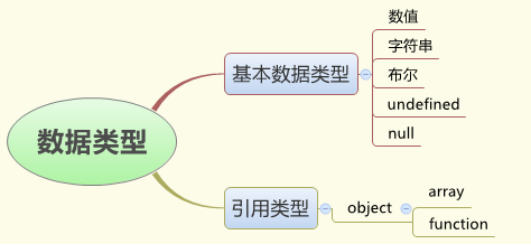

# javaScript(上)

## 课程引导

### javaScript是什么？

1. 语言的角度上来说讲：JavaScript是一门运行在浏览器端的脚本语言。
2. 从Web标准的角度来讲：JavaScript处在行为层。结构层（HTML），表现层（CSS），行为层（JavaScript）

### JavaScript和java有何关系？

基本上没有关系。
雷峰塔和雷锋的关系
实际上是有一点点，仅仅处于商业上的考虑。

(js是95年，（javascript之父布兰登·艾奇）项目的需要开发一种语言，网景公司livescript，由于当时java很火，于是起名为javascript)

### JavaScript可以做什么？

1. 表单验证 --- js的本质工作。验证的是格式
2. 更好的组织页面内容，让页面更加简洁。
3. Ajax，用于异步的交互，非常重要。(淘宝网用户注册)
4. 网页游戏，简称页游（4399）

### 关于javaScript我们应该知道的

1. 两个层面
    - 浏览器端的js
    - 服务端的js
2. 目前，我们专业与浏览器的的js,实际上,它分为三个部分：
    - ECMAScript，是js语言的标准，是一个规范，是js语言本身的一些内容。
    - BOM：浏览器对象模型，为我们提供了一些接口，可以和浏览器进行交互
    - DOM：文档对象模型，为我们提供了一些接口，可以操作页面中的任何元素和样式

ECMAScript：
ECMA是一个组织，欧洲计算机制造协会。（更名为javascipt后，为了更好的发展这门语言，ECMA接管了javascript）

ECMAScript是一个标准，它是用于制定规范的。
然后，需要针对规范有具体的实现。目前，有三种实现：

浏览器端，通常所讲的狭义上的js
服务器端，目前非常过的node.js
Flash，制作动画的一个软件

所以说，ECMAScript是最核心的内容。
我们的js基础，技术讲ECMAScript。

3. js的历史

目前前端开发，会部分用到ES6，尤其是服务器端和移动端的。包括一些流行的框架都使用了ES6语法。

目前，我们学习的是ES5部分。
到node和移动部分，我们在补充ES6的。

4. 心态

Js有点难，但是不至于说学不会。

宋代禅宗大师青原行思提出参禅的三重境界：

参禅之初，看山是山，看水是水；

禅有悟时，看山不是山，看水不是水；

禅中彻悟，看山仍然山，看水仍然是水。

Js太灵活了。

5. 参考书

JavaScript高级程序设计（红皮）

JavaScript权威指南（绿皮）

强调：
多思考，多总结，多敲代码

## 页面引入javaScript

1. 行内的方式

2. 内部的方式

3. 外部引入

4. JavaScript协议（了解）

## javaScript的几种输出方式

1. alert函数
2. document.write函数
3. console.log函数

## javaScript的基本语法

### 词法结构

1. 字符集unicode 
2. 区分大小写 （true和TRUE）
3. 忽略空白字符（空格、制表符和换行符）
4. 注释
5. 标识符和关键字（保留字）

### 变量和值

1. 变量的概念
2. 如何声明变量
    - 独立声明
    - 一次性声明多个
    - 重复声明
    - 遗漏声明
3. 变量命名规范
    - 只能是数字，字母，下划线，$，且不能以数字开头
    - 尽量见名知意
    - 推荐使用驼峰命名法

### 数据类型

1. 数值类型
    - 不区分整数值和浮点数值，都是浮点数
    - 最大值和最小值（Number.MAX_VALUE，Number.MIN_VALUE）
    - 整型的多种表示（十进制、十六进制、八进制）
    - 浮点数的多种写法 （3.14，.33333，6.02e3）
    - JavaScript算术运算的特殊性（溢出、被零整除都不会报错）
    - 特殊的NaN
    - 运算的不精确性
2. 字符串类型
3. 布尔类型
4. undefined和null
5. 引用类型

### 运算符

1. 运算数的个数：一元（一目）、二元（二目）、三元（三目）
2. 优先级，在复杂的运算中，谁先运算的问题
3. 结合性：左结合性、右结合性，编程语言中专用的
4. 运算符的副作用（赋值、递增、递减）

### 类型转换  

1. 隐式类型转换
2. 强制类型转换

### 表达式

1. 原始表达式
2. 运算符构成的表达式
3. 对象和数组初始化表达式
4. 函数定义表达式
5. 调用表达式
6. 对象创建表达式

### 语句

1. 顺序语句
2. 条件语句
    - if
    - if else
    - if else if else if else
3. 循环语句
    - for
    - while
    - do while
4. 跳转语句
    - break
    - continue

### 函数

1. 调用系统函数
2. 使用函数
3. 自定义函数
4. 函数调用及返回值
5. 函数参数
6. 函数作用域

### 认识对象

1. Date对象
2. Math对象
3. 自定义对象

### 数组

1. 创建数组
2. 数组的访问
3. 数组的特性
    - 对数据类型没有严格要求
    - 数组是动态的
    - 数组不一定是连续的，中间可以有空缺
    - 数组是对象的特殊形式，效率更高
4. 数组的长度
5. 遍历数组
6. 多维数组
7. 数组的常见方法

### 字符串

1. 创建字符串
2. 字符串的访问
3. 字符串的常用方法

