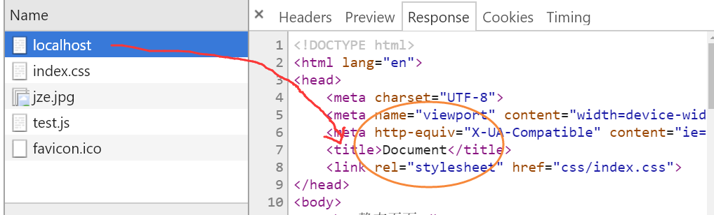

## url路由

Url，Uniform Resoure Locator（Location），统一资源定位器。
是互联网上标准资源的地址。互联网上的每个文件都有一个唯一的URL。

平常我们所说的网址，是url的一种，并且只是包含最常见的一些信息。
一个完整的url格式如下：


**协议：** 比如http、https、ftp

**身份验证：** 如果是http和https，直接忽略，如果是ftp，必须有身份验证
 
**主机：** 有两种表现形式，一是域名，而是ip。域名和ip具备对应关系。如图：


端口：一台计算机上执行多个程序（运行多个服务），但是又不相互冲突，可以使用端口，在不同的端口来运行不同的程序（服务）。（比如的电视机的频道）

**常见的端口有：**
- 80，http服务的端口
- 21，ftp端口
- 23，telnet
- 25，SMTP
- 110，POP3
- 443，SSL的端口
- 3306,数据库端口

一般来说，1~1024端口是系统保留的端口。

1024~35635，是用户自定义的端口。

比如，3000，qq端口1080，mysql的端口3306，mongodb的端口27017。

如果端口有冲突，就会出问题，不能正常运行。

**路径：** 文件的路径，包括路径名称和查询字符串。

**路径名：** 都是以/开头的，可以有很多层。

**查询字符串：** querystring，?后面的键值对构成的字符串，其作用就是在浏览器向服务器请求数据时携带的一些参数。针对同样的一个路径，通过查询字符串来获取不同的内容。这个字符串是作为条件来查询需要返回的数据，所以称之为查询字符串。

**散列：** hash，也叫哈希，使用#来表示，主要是在spa中使用比较多

在这个完整的url中，除了身份验证，其它都是非常重要的。

### 什么是路由

简单举例说明，假如我们有一台提供 Web 服务的服务器的网络地址是：10.0.0.1，而该 Web 服务又提供了三个可供用户访问的页面，其页面 URI 分别是：

http://10.0.0.1/

http://10.0.0.1/about

http://10.0.0.1/concat

那么其路径就分别是 /，/about，/concat。

当用户使用 http://10.0.0.1/about 来访问该页面时，Web 服务会接收到这个请求，然后会解析 URL 中的路径 /about，在 Web 服务的程序中，该路径对应着相应的处理逻辑，程序会把请求交给路径所对应的处理逻辑，这样就完成了一次「路由分发」，这个分发就是通过「路由」来完成的。

简单来说就是: **给定一个url，就返回一个相应的内容（通常是页面的形式）。**

### 如何实现url路由

要实现的目标：

http://localhost:3000/ 首页面

http://localhost:3000/list  列表页面

http://localhost:3000/detail 详情页面

```js
var http = require('http');
var server = http.createServer(function(req,res){
    res.writeHead(200,{"content-type":"text/html;charset=utf8"});
    res.write('<h2>路由</h2>');
    res.end();
});
server.listen(3000,function(){
    console.log('3000 ok...')
})
```

然后分别使用三个url访问之，如下：


针对不同的路径，没有做任何的判断和处理，一视同仁，所以返回的是相同的结果。

所以，需要针对不同的路径，分别返回不同的内容即可。

必须要获取url的路径，如何获取呢？

```js
    http.createServer(function(req,res){
        console.log(req.url);
        res.writeHead(200,{"content-type":"text/html;charset=utf8"});
        res.write('<h2>路由</h2>');
        res.end();
    });
```

只需要根据url的值，分别做相应处理即可.

## 解析查询字符串

长的什么样子？

它有一个非常明显的标志，就是 **?** 号

在url中，凡是有 **？** ,就表示查询字符串,querystring。


**?** 表示查询字符串的开始，查询字符串是有固定格式的，以键值对的形式出现的。
典型的格式：
```js
?key1=val1&key2=val2&key3=val3
```

querystring中是有三个符号：
- **?** querystring的标志
- **=** 键和值之间的连接符号
- **=** 键值对与键值对之间的连接符号

#### 查询字符串的作用

其实是我们在给服务端发出一个http 请求的时候，通常是get请求。需要获取相关的信息，由于信息比较多，我只关心其中的一部分信息，可以通过querystring来告诉服务端，获取的这是这些信息。服务端就将querystring作为查询的条件，然后返回相应的数据。

比如分页是非常典型的querystring
```
https://list.jd.com/list.html?cat=9987,653,655&page=2&sort=sort_rank_asc&trans=1&JL=6_0_0&ms=6#J_main
```

基本上，我们在使用的时候，用户在页面上进行某个操作，发出请求会携带个querystring。
作为服务端，我们需要获取用户提交的querystring，根据这个querystring返回相应的信息。

并且，在前后端进行交互的时候，经常需要沟通的部分，就是这个地方

在使用network面板的时候，可以使用querystring来查看查询字符串，如下：


### 如何解析

在进行服务端开发的时候，需要获取用户提交的querystring，然后根据querystring返回相关的内容。

使用http模块启动服务，访问localhost:8080?user=admin&password=123

querystring是url的一部分，可以通过req.url来获取

既然可以拿到这个url，/?user=admin&password=123

就可以对这个字符串进行处理，获取其中的信息。

其实就是字符串的处理:

使用字符串方法比较麻烦，所以我们使用queryString模块
```js
require('querystring').parse(req.url.substr(req.url.indexOf('?')+1))
```
其中，这里的parse和stringify和JSON对象的parse和stringify是一模一样的。
只是针对的目标不一样。Querystring处理的是查询字符串，JSON处理的是json格式的字符串。

```js
req.url.substr(req.url.indexOf('?')+1)
```
针对这句代码，我们在处理url地址取?号后时使用字符串方法比较麻烦。

其实，url本身的信息也是非常的多，在开发的时候，经常需要获取一个完整的url的所有信息，针对这个需求，node.js专门提供一个模块--- **url模块** 。
```js
require('url').parse()
```

将url字符串转成对象
```js
require('url').stringify()
```

将url格式的对象，转成字符串

最后，我们结合两个url和querystring模块，来完成对查询字符串的解析，如下:

```js
require('querystring').parse(require('url').parse(req.url).query)

```

## 载入静态页面

作为一个http服务器，最最基本的一个职责就是提供静态页面服务

在实际中，有如下三种方式实现静态页面的服务：
- 手动实现，结合http和fs即可
- 框架实现，express框架/koa框架
- 第三方的库，http-server

前面我们所写的代码，都是直接使用res向浏览端写会内容，如下：

```js
var http = require('http');
var server = http.createServer(function(req,res){
    res.writeHead(200,{'content-type','text/html;charset=utf8'});
    res.write('<h2>页面</h2>');
    res.end();
})
```

在实际开发中，一般就是，先准备好静态的html页面，然后通过res写回到浏览器端。

1. 编写一个html页面
2. 通过fs模块读取index.html中的内容
3. res.write写入回浏览器端

但是，在实际开发时，页面中肯定有图片，并且css和js是分离的。


注意：在进行node开发的时候，如果服务端代码没有做任何的修改，只是修改了静态资源（html、css和js文件），是不需要重启ndoe服务的.

执行，如下：


说明图片、css和js都没有生效，why?

查看network面板，发现有如下几个请求：


注意：在http中，每一个静态的资源（html文件、css文件、js文件、图片文件等）都是一个请求。

可以查看每个请求返回的内容：




针对request事件，每一次请求，都会触发，所以上述的5次请求，都会执行相同的代码，每次都读取index.html，然后作为结果返回。

这样肯定是不对，所以，需要分开来处理。针对不同的请求，需要返回不同的内容。

需要使用路由功能，编写代码：


<<< fragument/lesson5/http读文件.js


针对代码，说明：
- 没有写头信息，浏览器是如何识别文件及编码的呢？文件本身就有一些原信息，已经标明了该文件的类型和相应的字符集。
- 在处理css、js和图片时，并没有声明以哪种方式来解析，依靠node以及标签本身的信息来识别的。

## post请求及响应

Post请求，主要表现形式就是表单。

准备好一个表单， 编写一个login.html

```html
    <form action="/login" method="POST">
        <ul>
            <li>
                <label for="name">用户名</label>
                <input type="text" id="name" name="name">
            </li>
            <li>
                <label for="password">密码</label>
                <input type="password" id="password" name="password">
            </li>
            <li>
                <button type="submit">登陆</button>
            </li>
        </ul>

    </form>
```

载入这个静态页面

### 核心知识点

#### post提交的细节和特点

post是通过表单来提交的，可以查看network，如下：


可以看出，表单在提交数据的时候，是以字符串的形式来发送的，并且这个字符串的格式和querystring的格式是一致的。

换言之，表单在提交数据的时候，会收集表单所有的数据，然后拼接成一个字符串，进行传送。

还有，form data在从浏览器端向服务端传输的时候，不是一次性的传递过去，而是采用了流的传输模式，一次之只能传递一小块，如图：


这就意味着，在服务端是一次接受一小块.

#### 利用req对象的data事件和end事件

关键问题是如何才能获取到浏览器传输的数据呢？

此时，就需要利用req对象的data事件和end事件了。

事件 | 说明 | 备注
---|---|---
data | 数据传递时触发 |由Readable Stream提供的一些接口，然后incomingMessage实现了这些接口
end | 没有更多数据提供时触发 |由Readable Stream提供的一些接口，然后incomingMessage实现了这些接口

在每一次传递一个chunk的时候，都会触发data事件，并且将传递的数据作为参数来传入。
当整个的数据传输完毕时，就会触发end事件